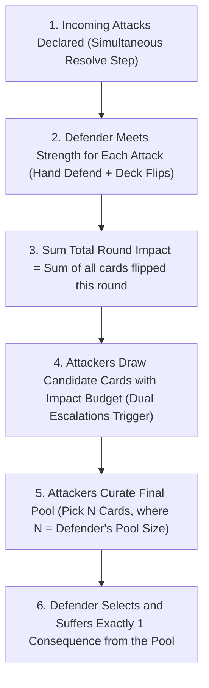

# Consequence Pool & Tag Escalation Resolution Engine

## Executive Summary & Design Overview

This directory contains the settled design proposal, play traces, equipment architecture, prototype consequence database, and authoring guidelines for replacing the legacy `Defense` and `Resilience` resolution mechanics with the **Consequence Pool & Tag Escalation Engine**.

In this new engine, resolution is reframed as an **"I Cut, You Choose" consequence drafting market**:

1. **Impact is Currency**: $1\text{ Impact} = 1\text{ Severity Level}$ to purchase consequence card draws.
2. **Pool Size is the Soak Multiplier**: The defender's gear and nature determine how many consequence slots the attackers must populate.
3. **Implicit Blanks ("No Consequence")**: Unfilled pool slots become "No Consequence", creating an emergent armor soak threshold without requiring abstract sheet divisor stats.
4. **Tag Escalations Replace Global Resilience**: Synergistic tags (`positioning`, `fatigue`, `injury`, `fear`, `armor`) drive the downward spiral contextually and realistically.

---

## 1. Directory Manifest & Key Documents

| File                                                                                 | Purpose & Contents                                                                                                                                                              |
| :----------------------------------------------------------------------------------- | :------------------------------------------------------------------------------------------------------------------------------------------------------------------------------ |
| **[proposal.md](proposal.md)**                                                       | **The Core Rules Patch**: The concise, focused replacement text for `## Defend Actions` in `core-rules.md`.                                                                     |
| **[guide-to-writing-consequences.md](guide-to-writing-consequences.md)**             | **Authoring & Style Guide**: Rules for future agent runs (Continual Passives, Action vs. Task Duality, `Requires:` vs. `Cost:`, color qualifiers, ban on "damage" terminology). |
| **[consequences.yaml](consequences.yaml)**                                           | **Prototype Card Database**: 27 fully drafted cards across Severities 1–6 with rules, in-combat actions, downtime tasks, escalation clauses, and clinical/biomechanical notes.  |
| **[equipment.yaml](equipment.yaml)**                                                 | **Item & Armor Architecture**: Two-sided armor models (`Intact` vs. `Damaged`), Pool Size passives, and Pierce mechanics.                                                       |
| **[trace-1-unarmored-skirmish.md](trace-1-unarmored-skirmish.md)**                   | **Play Trace 1**: Unarmored duel (Pool Size 2) showing 3 Impact spend ($2+1$) and defender drafting.                                                                            |
| **[trace-2-armored-knight-power-strike.md](trace-2-armored-knight-power-strike.md)** | **Play Trace 2**: Full Harness (Pool Size 4) vs. Pierce 4 and Pierce 6 heavy strikes.                                                                                           |
| **[trace-3-tag-escalation-spiral.md](trace-3-tag-escalation-spiral.md)**             | **Play Trace 3**: Multi-round tag escalation cascade (`Poor Footing` + `Afraid` $\to$ Sev 4).                                                                                   |
| **[trace-4-mob-combat-multi-attacker.md](trace-4-mob-combat-multi-attacker.md)**     | **Play Trace 4**: 3 Goblins vs. Armored PC; demonstrates canonical Batched Round Consequence Pool resolution.                                                                   |

---

## 2. Core Resolution Engine (Crisis Time)



### Step 1: Meet Strength & Accumulate Round Impact

1. **Defend from Hand**: For each incoming attack, the defender may play **Defend** cards from their hand. Defend cards contribute their printed value in the attack's `Color` to meet its `Strength` without generating Impact.
2. **Flip from Deck**: If the attack's Strength is not fully met from hand, flip cards from the top of the deck one by one until the cumulative value in the attack's Color meets or exceeds the attack's Strength.
3. **Accumulate Impact**: Sum the total number of cards flipped across **all** attacks against that defender in the round. This total is the **`Total Round Impact`**.

### Step 2: Draw Candidate Consequences & Resolve Escalations

1. **Spend Impact as Currency**:
   - Attackers spend Total Round Impact to draw candidate cards from the severity decks:
     - **Severity 1** costs **1 Impact**
     - **Severity 2** costs **2 Impact**
     - **Severity 3** costs **3 Impact**
     - **Severity $S$** costs **$S$ Impact**
   - Attackers may draw candidates in any combination of severities they can afford. If multiple attackers attacked the same target, they share the budget and draw candidates together.
2. **Dual-Source Escalations**:
   - As each candidate card is drawn, check its tags against:
     - (a) **Active Table Conditions** already on the defender.
     - (b) **Prior Candidate Cards** drawn into the attacker's hand during this resolution.
   - If an escalation matches, return the drawn card, draw the upgraded replacement card, and mark the source card as used. Each condition can only trigger an escalation **once per round** (turn table conditions sideways 90°).

### Step 3: Curate the Consequence Pool (The "I Cut" Step)

1. **Determine Pool Size ($N$)**:
   - **Minions / Mooks**: Pool Size **1** (no drafting choice; instant hit).
   - **Unarmored Heroes**: Base Pool Size **2** (base heroic drafting choice).
   - **Light Armor (Gambeson & Maile)**: Consequence Pool Size **3** (Pierce 4 ignores to 2).
   - **Heavy Armor (Full Harness)**: Consequence Pool Size **4** (Pierce 6 ignores to 3; Pierce 12 ignores to 2).
2. **Pick $N$ Cards for the Final Pool**:
   - The attackers select exactly $N$ cards from their candidate hand to present to the defender.
   - Unselected candidate cards are returned to their decks.
3. **Implicit "No Consequence" Blanks**:
   - If attackers drew fewer than $N$ candidate cards, any unfilled slots in the pool of $N$ are **implicitly filled with "No Consequence"**.
   - _Mathematical Formula to Guarantee Severity $S$_:
     $$\text{Impact Required} = \text{Pool Size } (N) \times S$$
     If total Impact/escalations fall below this threshold, at least one slot will contain a lower severity or "No Consequence", which the defender can choose.

### Step 4: Defender Suffers Exactly 1 Consequence (The "You Choose" Step)

1. The curated pool of $N$ cards (and any "No Consequence" blanks) is presented to the defender.
2. The defender **chooses exactly 1 consequence** from the pool to suffer.
3. If "No Consequence" is in the pool, the defender may select it to suffer no additional harm beyond the stamina/fatigue cards already flipped.
4. The chosen card takes effect immediately according to its rules. All unchosen cards in the pool are returned to their decks.

---

## 3. Character Tiers & Pool Size Architecture

```
+-----------------------------------------------------------------------------------+
| MINIONS (Pool Size 1)                                                             |
| - Attacker spends Impact -> Draws 1 Card -> Minion suffers it immediately.         |
| - Zero GM decision time; 3-4 Impact takes them out cleanly.                       |
+-----------------------------------------------------------------------------------+
| UNARMORED HEROES (Pool Size 2)                                                    |
| - Attacker spends Impact across 2 slots -> Defender chooses 1.                    |
| - Requires 2 Impact for Sev 1; 4 Impact for Sev 2; 12 Impact for Sev 6 (KO).      |
+-----------------------------------------------------------------------------------+
| ARMORED COMBATANTS (Pool Size 3 - 4)                                              |
| - Light Armor (Pool 3): Needs 3 Impact for Sev 1; 6 for Sev 2; 18 for Sev 6.      |
| - Heavy Armor (Pool 4): Needs 4 Impact for Sev 1; 8 for Sev 2; 24 for Sev 6.      |
| - Pierce reduces effective pool size back down toward 2.                          |
+-----------------------------------------------------------------------------------+
```

### Symmetrical Minion Design

Minions have `Consequence Pool Size: 1` printed on their Nature card. When PCs attack a minion and generate 2 Impact, the attacker simply spends 2 Impact to draw 1 Severity 2 card. There is no second slot. The minion takes the card. If the minion is defeated at Severity 2, it drops instantly. This eliminates GM drafting overhead while making mook-cleaving fast and satisfying.

---

## 4. The 6-Tier Severity Scale & Anti-Alpha Strike Mathematics

| Severity | Category                   | Description & Gameplay Effect                                                                   | Examples                                                                 |
| :------: | :------------------------- | :---------------------------------------------------------------------------------------------- | :----------------------------------------------------------------------- |
|  **1**   | **Minor Friction / Wear**  | Fleeting setbacks, positioning slips, or minor stamina costs. Easily pushed through or cleared. | `Near Miss`, `Poor Footing`, `Out of Breath`, `Slightly Battered`        |
|  **2**   | **Tactical Constraint**    | Specific tactical hindrances that limit actions or make you vulnerable to follow-up strikes.    | `Rattled Guard`, `Strained Offense`, `Afraid`, `Off Balance`             |
|  **3**   | **Significant Impediment** | Severe tactical disruptions or meaningful physical wounds requiring mid-combat attention.       | `Mild Concussion`, `Terrified`, `Hamstrung`, `Knocked Prone`             |
|  **4**   | **Major Trauma**           | Structural failure of defense or severe bodily injury. Forces a major tactical shift.           | `Broken Arm`, `Sundered Armor`, `Dislocated Knee`, `Deep Puncture Wound` |
|  **5**   | **Critical Injury**        | Life-threatening trauma or near-total collapse. One step from defeat.                           | `Severe Concussion`, `Sucking Chest Wound`, `Compound Leg Fracture`      |
|  **6**   | **Taken Out**              | Incapacitated, unconscious, dying, or completely removed from the conflict.                     | `Unconscious`, `Mortal Bleedout`, `Mind Void`, `Taken Out (Surrendered)` |

### Why 6 Severities Solves the "Alpha Strike" Problem

Under the $\text{Impact} = \text{Pool Size} \times \text{Severity}$ formula:

- **To One-Shot an Unarmored Hero (Sev 6)**: Attackers need $2 \times 6 = \mathbf{12\text{ Impact}}$ (requiring $\sim 30\text{ Strength}$).
- **To One-Shot an Armored Hero (Sev 6 in Full Harness)**: Attackers need $4 \times 6 = \mathbf{24\text{ Impact}}$ (requiring $\sim 60\text{ Strength}$).

True 1-hit kills are mathematically impossible in opening rounds without prior setup. Instead, combat follows a **2–3 round telegraphed downward spiral**:

1. **Round 1**: Attackers land a 4-Impact strike $\to$ inflicts a Severity 1 or 2 condition (e.g., `Poor Footing` [tag: `positioning`]).
2. **Round 2**: Attackers exploit that positioning vulnerability. A modest 4-Impact strike triggers a $+2$ Tag Escalation, spiking the drawn card from Severity 2 to **Severity 4** (`Dislocated Knee`).
3. **Round 3**: With multiple tags compromised, subsequent pressure easily cascades into **Severity 5** or **Severity 6**.

---

## 5. General Actions Adaptation (Non-Crisis Resolution)

General Actions resolve using the exact same core engine without modification:

1. The GM declares the challenge's **Color** and **Strength** (e.g. Blue 10 to pick a complex lock; Yellow 25 to leap a chasm).
2. The player flips cards to meet the Strength.
3. The number of flipped cards equals the **Impact**.
4. The GM spends the Impact to build a Consequence Pool of the player's Pool Size (usually 2).
5. The player drafts 1 consequence (representing lost time, broken lockpicks, alerted guards, or muscle strain). Success is guaranteed; the resolution determines the collateral cost.

---

## 6. Alternative Variant: Per-Attack Resolution

While **Batched Resolution** is the standard default for Crisis Time, groups or specific modules may use **Per-Attack Resolution**:

### How It Works

- Instead of summing Impact across the round, each attack is resolved sequentially:
  1. Defender flips for Attack A $\to$ Attacker A builds Pool A $\to$ Defender chooses Consequence A.
  2. Defender flips for Attack B $\to$ Attacker B builds Pool B $\to$ Defender chooses Consequence B.

### Tradeoff Analysis

- **When to Use Per-Attack Resolution**:
  - **1v1 Duels**: When exactly one attack occurs per round, Batched and Per-Attack resolution are mathematically identical.
  - **General Actions**: Solo non-combat challenges resolve as single standalone actions.
- **Why Batched Resolution is the Primary Standard**:
  - Eliminates repetitive drafting loops during multi-combatant scuffles.
  - Prevents high-pool armor from rendering swarms of weaker foes completely harmless (see [trace-4-mob-combat-multi-attacker.md](trace-4-mob-combat-multi-attacker.md)).
  - Keeps Crisis Time fast-paced, decisive, and climactic.

---

## 7. Evaluation Against Design Precepts

| Design Precept                   | Alignment in Proposed System                                                                                                                                                                     |
| :------------------------------- | :----------------------------------------------------------------------------------------------------------------------------------------------------------------------------------------------- |
| **Default to Success at a Cost** | **Perfect alignment**. Tasks and attacks land; resolution determines the exact tactical cost chosen by the defender.                                                                             |
| **Mechanical Elegance**          | **High**. Removes two abstract character sheet stats (`Defense` and `Resilience`). Replaces division math with physical card drafting.                                                           |
| **Ludonarrative Harmony**        | **Contextual & Thematic**. Wounds compound contextually via tags rather than through an arbitrary global counter. Armored fighters absorb diffuse blows; targeted tags cause realistic collapse. |
| **Player Agency**                | **Very High**. Both attacker (allocating impact and hunting tag synergies) and defender (choosing the manageable penalty) make active, high-stakes decisions every turn.                         |

---

## 8. Suggested Next Steps for Future Threads

When opening a new conversation, the next priorities are:

1. **Core Rules Integration**:
   - Draft the formal replacement section for `design/rules/core-rules.md` (replacing `## Defend Actions` using [proposal.md](proposal.md)).
   - Update `design/rules/players-guide.md` and `design/rules/gamemaster-guide.md` to reflect Consequence Pool drafting.
2. **Expanding Domain Consequence Decks**:
   - Author specialized decks following [guide-to-writing-consequences.md](guide-to-writing-consequences.md) for:
     - _Exploration & Environmental Trauma_ (`Cold`, `Heat`, `Dehydration`, `Trench Foot`).
     - _Social & Relational Fallout_ (`Status`, `Ostracized`, `Exposed Lie`, `Blackmail`).
     - _Arcane & Alchemical Backdrafts_ (`Mana Burn`, `Crystallization`, `Planar Distortion`).
3. **PC & Monster Deck Audits**:
   - Audit `data/cards/pc/*.yaml` and `data/cards/monsters/*.yaml` to ensure passive traits and Pierce keywords align with the new armor pool mechanics.
