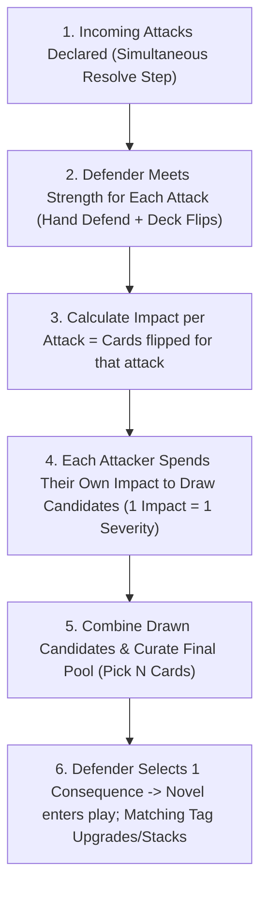

# Consequence Pool & Tag Escalation Resolution Engine

## Executive Summary & Design Overview

This directory contains the settled design proposal, play traces, equipment architecture, prototype consequence database, and authoring guidelines for replacing the legacy `Defense` and `Resilience` resolution mechanics with the **Consequence Pool & Tag Escalation Engine**.

In this new engine, resolution is reframed as an **"I Cut, You Choose" consequence drafting market**:

1. **Impact is Currency**: $1\text{ Impact} = 1\text{ Severity Level}$ to purchase consequence card draws.
2. **Pool Size is the Soak Multiplier**: The defender's gear and nature determine how many consequence slots the attackers must populate.
3. **Implicit Blanks ("No Consequence")**: Unfilled pool slots become "No Consequence", creating an emergent armor soak threshold without requiring abstract sheet divisor stats.
4. **Tag Escalations Replace Global Resilience**: Synergistic tags (`positioning`, `fatigue`, `injury`, `fear`, `armor`) drive the downward spiral contextually and realistically.

---

## 1. Directory Manifest & Key Documents

| File                                                                                 | Purpose & Contents                                                                                                                                                              |
| :----------------------------------------------------------------------------------- | :------------------------------------------------------------------------------------------------------------------------------------------------------------------------------ |
| **[proposal.md](proposal.md)**                                                       | **The Core Rules Patch**: The concise, focused replacement text for `## Defend Actions` in `core-rules.md`.                                                                     |
| **[players-guide-patch.md](players-guide-patch.md)**                                 | **Player's Guide Patch**: Tactical strategy for consequence curation ("I Cut"), intra-tier evaluation, and defense ("You Choose").                                              |
| **[gamemaster-guide-patch.md](gamemaster-guide-patch.md)**                           | **Gamemaster's Guide Patch**: Antagonist curation tactics (brutes, swarms, combined assaults), minion batching, and General Actions calibration.                                |
| **[guide-to-writing-consequences.md](guide-to-writing-consequences.md)**             | **Authoring & Style Guide**: Rules for future agent runs (Continual Passives, Action vs. Task Duality, `Requires:` vs. `Cost:`, color qualifiers, ban on "damage" terminology). |
| **[consequences.yaml](consequences.yaml)**                                           | **Prototype Card Database**: Fully drafted cards across Severities 1–5 with rules, in-combat actions, downtime tasks, escalation clauses, and clinical/biomechanical notes.     |
| **[equipment.yaml](equipment.yaml)**                                                 | **Item & Armor Architecture**: Two-sided armor models (`Intact` vs. `Damaged`), 1–5 Pool Size spectrum, and stepped Pierce mechanics.                                           |
| **[trace-1-unarmored-skirmish.md](trace-1-unarmored-skirmish.md)**                   | **Play Trace 1**: Unarmored duel (Pool Size 2) showing 3 Impact spend ($2+1$) and defender drafting.                                                                            |
| **[trace-2-armored-knight-power-strike.md](trace-2-armored-knight-power-strike.md)** | **Play Trace 2**: Full Harness (Pool Size 5) vs. Pierce 4 and Pierce 8 heavy strikes.                                                                                           |
| **[trace-3-tag-escalation-spiral.md](trace-3-tag-escalation-spiral.md)**             | **Play Trace 3**: Multi-round tag escalation cascade (`Poor Footing` + `Afraid` $\to$ Sev 3 $\to$ Sev 5 defeat).                                                                |
| **[trace-4-mob-combat-multi-attacker.md](trace-4-mob-combat-multi-attacker.md)**     | **Play Trace 4**: 3 Goblins vs. Armored PC; demonstrates canonical Batched Round Consequence Pool resolution.                                                                   |

---

## 2. Core Resolution Engine (Crisis Time)

### Step 1: Meet Strength & Accumulate Impact

1. **Defend from Hand**: For each incoming attack, the defender may play **Defend** cards from their hand. Defend cards contribute their printed value in the attack's `Color` to meet its `Strength` without generating Impact.
2. **Flip from Deck**: If the attack's Strength is not fully met from hand, flip cards from the top of the deck one by one until the cumulative value in the attack's Color meets or exceeds the attack's Strength.
3. **Accumulate Impact**: The number of cards flipped to defend against each attack is that attack's **`Impact`**.

### Step 2: Draw Candidate Consequences

1. **Spend Impact as Currency**:
   - Each attacker spends the Impact generated by their attack to draw candidate cards directly from the severity decks:
     - **Severity 1** costs **1 Impact**
     - **Severity 2** costs **2 Impact**
     - **Severity 3** costs **3 Impact**
     - **Severity $S$** costs **$S$ Impact**
   - Attackers may allocate their individual Impact across any combination of severities they can afford (e.g., 4 Impact can buy one Sev 4, two Sev 2s, or one Sev 3 + one Sev 1).
   - If multiple attackers targeted the same defender, each spends their own impact; leftover impact cannot be merged across attackers. All drawn cards are combined into a single candidate hand before curation.

### Step 3: Curate the Consequence Pool (The "I Cut" Step)

1. **Check Pool Size ($N$)**:
   - The defender's traits and equipped gear set the **Consequence Pool Size ($N$)** (typically 1 for minions, 2 for unarmored heroes, 3 for maille/brigandine, 4 for full plate; see Section 3 for full breakdown).
2. **Pick $N$ Cards for the Final Pool**:
   - The attackers select exactly $N$ cards from their candidate hand to present to the defender.
   - **Targeting Active Vulnerabilities:** Attackers look at the conditions already in front of the defender and curate cards that match active tags to force a dangerous condition stack/upgrade.
   - Unselected candidate cards are returned to their decks.
3. **Implicit "No Consequence" Blanks**:
   - If attackers drew fewer than $N$ candidate cards, any unfilled slots in the pool of $N$ are **implicitly filled with "No Consequence"**.
   - _Mathematical Formula to Guarantee Severity $S$_:
     $$\text{Impact Required} = \text{Pool Size } (N) \times S$$
     If total Impact falls below this threshold, at least one slot will contain a lower severity or "No Consequence", which the defender can choose.

### Step 4: Defender Suffers Exactly 1 Consequence (The "You Choose" Step)

1. The curated pool of $N$ cards (and any "No Consequence" blanks) is presented to the defender.
2. The defender **chooses exactly 1 consequence** from the pool to suffer.
3. If "No Consequence" is in the pool, the defender may select it to suffer no additional harm beyond the stamina/fatigue cards already flipped.
4. **Resolution & Table Escalation:**
   - **Transient Consequence:** If the chosen card is a transient effect (e.g., `Out of Breath`, `Shallow Laceration`, `Near Miss`), apply its immediate deck/status effect and discard/return it immediately. Transient cards do not enter play on the table and have no escalation triggers.
   - **Novel Condition:** If the defender has no active condition with an `escalate:` trigger matching the chosen card's leaf tags, place the chosen card into play as a new active condition.
   - **Condition Escalation & Card Fallbacks:** If an active condition in play in front of the defender has an `escalate:` trigger matching the chosen card's leaf tag, follow the explicit instructions printed on the active card (upgrading to the indicated condition, entering play in parallel, applying a setback to current mitigation progress, or resolving a kinetic overmatch wildcard if the track is already at its ceiling). When an upgrade occurs, discard the lower active condition and put the upgraded condition into play.
5. All unchosen cards in the pool are returned to their decks.

---

## 3. Character Tiers & Pool Size Architecture

An entity's **Consequence Pool Size ($N$)** defines the number of consequence slots the attacker must fill to guarantee harm. Pool size is contextual and domain-specific:

- **Armor defines Pool Size against Physical Harm:** Physical armor (gambeson, maille, full plate) increases Pool Size specifically against physical trauma and melee/ranged strikes.
- **Domain Cards & Relevant Standing:** Table cards and traits define pool sizes for non-physical spheres (e.g., a `Silver Tongue` card gives Pool Size 3 for social debate and composure defense).
- **Universal Baseline Fallback ($N = 2$):** For any challenge or situation where an entity does not have a specific armor, skill, or table card in play, their Consequence Pool Size defaults to **2**. Minions have an inherent Pool Size of **1** across all domains.

| Archetype / Armor                           | Pool Size ($N$) |          Soak Threshold (Sev 1)          | Pierce Interactions                                          | Tactical Profile                                                                |
| :------------------------------------------ | :-------------: | :--------------------------------------: | :----------------------------------------------------------- | :------------------------------------------------------------------------------ |
| **Minions / Mooks**                         |      **1**      |         Instant Hit ($I \ge 1$)          | N/A                                                          | No drafting choice; single slot means every point of Impact buys harm directly. |
| **Universal Baseline / Unarmored**          |      **2**      | $I \le 1$ ($2\text{ Impact for Sev } 1$) | N/A                                                          | Base heroic drafting choice ($2 \times S$); requires active hand defense.       |
| **Light Armor (Gambeson / Boiled Leather)** |  **3 (Phys)**   | $I \le 2$ ($3\text{ Impact for Sev } 1$) | Pierce 4 reduces to 2                                        | Reliable frontline baseline; soaks stray blows ($3 \times S$).                  |
| **War Armor (Maille Hauberk / Brigandine)** |  **4 (Phys)**   | $I \le 3$ ($4\text{ Impact for Sev } 1$) | Pierce 4 reduces to 3; Pierce 8 reduces to 2                 | Heavy battlefield protection; cushions swarms and power strikes ($4 \times S$). |
| **Full Plate Harness / Giant Monsters**     |  **5 (Phys)**   | $I \le 4$ ($5\text{ Impact for Sev } 1$) | Pierce 4 reduces to 4; Pierce 8 reduces to 3; Pierce 12 to 2 | Walking fortress; immune to diffuse hits; requires tag setup or armor-piercing. |

### Symmetrical Minion Design

Minions have `Consequence Pool Size: 1` printed on their Nature card. When PCs attack a minion and generate 2 Impact, the attacker simply spends 2 Impact to draw 1 Severity 2 card. There is no second slot. The minion takes the card. Because minions have no blank slots to dilute incoming harm, even moderate attacks inflict immediate, unavoidable consequences. When an attack reaches terminal severity or compounded trauma overwhelms them, they drop cleanly. (Potential future design space: exploring specific fragile minion archetypes if needed, though Pool Size 1 already renders monsters highly vulnerable). This eliminates GM drafting overhead while making mook-cleaving fast and satisfying.

---

## 4. The 5-Tier Severity Scale & Downward Spiral Mathematics

| Severity | Category                                | Description & Gameplay Effect                                                                    | Examples                                                                           |
| :------: | :-------------------------------------- | :----------------------------------------------------------------------------------------------- | :--------------------------------------------------------------------------------- |
|  **1**   | **Fleeting Friction & Wear**            | Fleeting setbacks, minor startles, or brief stamina costs. Transient or easily pushed through.   | `Near Miss`, `Poor Footing`, `Out of Breath`, `Dust in Eyes`, `Shallow Laceration` |
|  **2**   | **Tactical Impairment / Minor Injury**  | Specific tactical hindrances that limit actions or make you vulnerable to follow-up strikes.     | `Rattled Guard`, `Strained Offense`, `Afraid`, `Off Balance`, `Bleeding Cut`       |
|  **3**   | **Platform Ceilings & Moderate Trauma** | Complete stance loss, concussive fog, cracked ribs, or deep lacerations. Major tactical crisis.  | `Knocked Prone`, `Mild Concussion`, `Cracked Ribs`, `Deep Laceration`, `Hamstrung` |
|  **4**   | **Severe Structural Trauma**            | Structural failure of defense, bone fractures, arterial bleeding, sundered plate, severe trauma. | `Broken Arm`, `Severe Concussion`, `Sundered Armor`, `Arterial Hemorrhage`         |
|  **5**   | **Taken Out / Incapacitated**           | Incapacitated, unconscious, dying, or completely removed from the conflict.                      | `Unconscious`, `Mortal Bleedout`, `Mind Void`, `Taken Out (Surrendered)`           |

### Anti-Alpha Strike & Downward Spiral Mathematics

Under the $\text{Impact} = \text{Pool Size } (N) \times \text{Severity } (S)$ formula:

- **To One-Shot an Unarmored Hero ($N=2$, Sev 5)**: Attackers need $2 \times 5 = \mathbf{10\text{ Impact}}$ ($\sim 20\text{ unmet Strength}$ undefended). Fresh PCs with defensive cards in hand easily absorb or parry incoming Strength, preventing opening-turn defeats unless caught completely unprepared and undefended.
- **To One-Shot a Combatant in Light Armor ($N=3$, Sev 5)**: Attackers need $3 \times 5 = \mathbf{15\text{ Impact}}$ ($\sim 30\text{ unmet Strength}$).
- **To One-Shot a Warrior in War Armor ($N=4$, Sev 5)**: Attackers need $4 \times 5 = \mathbf{20\text{ Impact}}$ ($\sim 40\text{ unmet Strength}$).
- **To One-Shot a Knight in Full Plate ($N=5$, Sev 5)**: Attackers need $5 \times 5 = \mathbf{25\text{ Impact}}$ ($\sim 50\text{ unmet Strength}$).

Combatants rarely reach Severity 5 via a single massive direct purchase. Instead, combat follows an accelerating, non-linear downward spiral driven by compounding vulnerabilities:

1. **Round 1 (Initial Setup)**: Attackers land a 4-Impact strike against an unarmored defender ($N=2$) $\to$ offers Sev 2 `Afraid` and Sev 2 `Off Balance`. Defender takes `Afraid` (enters play).
2. **Round 2 (Compounding Friction)**: Attackers land a 4-Impact strike and deliberately offer Sev 2 `Afraid` (fear tag) and Sev 2 `Off Balance`. Defender chooses `Afraid`, triggering active `Afraid`'s `escalate:` clause $\to$ upgrades to **Severity 3** (`Terrified`).
3. **Round 3 (Defensive Breakdown & Trauma)**: With defenses depleted and action taxes mounting, follow-up strikes penetrate armor or exploit posture, landing **Severity 4** trauma (`Sundered Armor` flipping armor to Damaged and reducing pool size $N$, or physical bone/arterial trauma).
4. **Round 4 (Terminal Resolution)**: Compounding impact and shrinking pool sizes allow attackers to reach **Severity 5** (`Mind Void` or `Unconscious`) to conclude the conflict decisively.

---

## 5. General Actions Adaptation (Non-Crisis Resolution)

General Actions resolve using the exact same core engine without modification:

1. The GM declares the challenge's **Color** and **Strength** (e.g. Blue 10 to pick a complex lock; Yellow 25 to leap a chasm).
2. The player flips cards to meet the Strength.
3. The number of flipped cards equals the **Impact**.
4. The GM spends the Impact to build a Consequence Pool of the player's domain Pool Size (fallback 2, or modified by relevant skills/tools).
5. The player drafts 1 consequence (or "No Consequence" if an empty slot remains).

### Single-Card Flips and Clean Success ("Saying Yes")

When a player meets the required Strength with a **single card flip** ($\text{Impact} = 1$):

- The GM draws 1 candidate card from the appropriate domain Severity 1 deck.
- Against the baseline Pool Size ($N = 2$), the second slot is an **implicit "No Consequence" blank**.
- The player selects "No Consequence," succeeding cleanly with zero complications beyond the single card expended from their deck.

**Design Philosophy Alignment:**
The core intent of "Success at a Cost" is that the system introduces complications rather than having the rules say "No"—but the rules are fully allowed to say "Yes." Resolving a check with a single card flip represents a character expending a tiny bit of energy to succeed fully without complications. In fact, if a player resolves a task in a single flip, it was borderline whether the GM even needed to call for a check at all versus simply saying "yup" and moving on. Complications are reserved for genuine strain or active opposition ($\text{Impact} \ge N$).

## 6. Multi-Attacker Combat & Curation Leverage

When multiple attackers target the same defender during Crisis Time, their actions resolve through **Batched Round Resolution**:

### How It Works

1. **Individual Spending:** Each attacker spends their own generated Impact to draw candidate cards into a single combined candidate hand.
2. **Surplus Curation Leverage:** When multiple attackers hit a target, the combined candidate hand often exceeds the defender's Pool Size ($N$). The attacking side curates down to exactly $N$ cards:
   - **Tag Synergy Hunting:** Surplus draws dramatically increase the probability of offering a consequence that matches an active condition on the defender, accelerating dangerous tag escalations.
   - **Filtering Soft Options:** Attackers can discard transient or mild results (e.g., `Near Miss`) and populate the pool exclusively with high-priority, situationally crippling options.
3. **Deck Attrition as Primary Mob Danger:** Even though the defender only selects one condition from the curated pool, they were forced to flip cards to meet the Strength of every incoming attack. Defending against a swarm of 3–5 foes expends a massive portion of the defender's 24-card deck in a single round, rapidly triggering Fatigue Cycles and pushing them toward Defensive Collapse.

---

## 7. Evaluation Against Design Precepts

| Design Precept                   | Alignment in Proposed System                                                                                                                                                                     |
| :------------------------------- | :----------------------------------------------------------------------------------------------------------------------------------------------------------------------------------------------- |
| **Default to Success at a Cost** | **Perfect alignment**. Tasks and attacks land; resolution determines the exact tactical cost chosen by the defender.                                                                             |
| **Mechanical Elegance**          | **High**. Removes two abstract character sheet stats (`Defense` and `Resilience`). Replaces division math with physical card drafting.                                                           |
| **Ludonarrative Harmony**        | **Contextual & Thematic**. Wounds compound contextually via tags rather than through an arbitrary global counter. Armored fighters absorb diffuse blows; targeted tags cause realistic collapse. |
| **Player Agency**                | **Very High**. Both attacker (allocating impact and hunting tag synergies) and defender (choosing the manageable penalty) make active, high-stakes decisions every turn.                         |

---

## 8. Suggested Next Steps for Future Threads

### Settled Decisions from 5-Tier Migration

- **5-Tier Severity Scale**: Firmly settled (1: Fleeting Friction, 2: Tactical Impairment, 3: Platform Ceilings & Moderate Trauma, 4: Severe Structural Trauma, 5: Taken Out / Incapacitation).
- **The Organic Asymmetry Standard**: Escalation tracks must reflect narrative and clinical reality rather than forced 5-step symmetry. Platform tracks have ceilings at Sev 3 (`Knocked Prone`) and Sev 4 (`Sundered Armor`) triggering Anvil wildcards; vascular cuts coexist in parallel; head trauma follows clinical neurotrauma stages.
- **Symmetrical Minions**: Minions with `Pool Size 1` are inherently fragile (no blank slots to dilute harm); printed early defeat thresholds remain speculative design space.

### Open Questions for Exploration

- **Tier 5 Implementation**: Does Tier 5 function best as a physical candidate card deck drawn when spending 5 Impact, or as an emergent, narrative exit state (_"describe how this foe is dispatched"_ when terminal conditions or compounded trauma trigger)?

### Next Action Priorities

1. **Core Rules Integration**:
   - Draft the formal replacement section for `design/rules/core-rules.md` (replacing `## Defend Actions` using [proposal.md](proposal.md)).
   - Update `design/rules/players-guide.md` and `design/rules/gamemaster-guide.md` to reflect Consequence Pool drafting.
2. **Expanding Domain Consequence Decks**:
   - Author specialized decks following [guide-to-writing-consequences.md](guide-to-writing-consequences.md) and the Organic Asymmetry Standard for:
     - _Exploration & Environmental Trauma_ (`Cold`, `Heat`, `Dehydration`, `Trench Foot`).
     - _Social & Relational Fallout_ (`Status`, `Ostracized`, `Exposed Lie`, `Blackmail`).
     - _Arcane & Alchemical Backdrafts_ (`Mana Burn`, `Crystallization`, `Planar Distortion`).
3. **PC & Monster Deck Audits**:
   - Audit `data/cards/pc/*.yaml` and `data/cards/monsters/*.yaml` to ensure passive traits and Pierce keywords align with the new armor pool mechanics.
