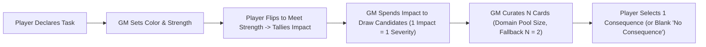

# Gamemaster's Guide Patch: Running the Consequence Engine

Patch and companion guide for `design/rules/gamemaster-guide.md`, integrating the **Consequence Pool & Tag Escalation Engine**.

---

## 1. The Gamemaster's Role in Consequence Drafting

Under the Consequence Pool engine, the GM exercises narrative direction and tactical adjudication through the tactile mechanics of card drafting:

1. **Curating for Antagonists ("I Cut")**: When monsters and NPCs attack player characters, the GM spends each attacker's generated Impact, builds a candidate hand, and curates an $N$-card pool to present to the player.
2. **Suffering for Bosses ("You Choose")**: When players strike an elite antagonist or boss, the GM evaluates the players' curated pool and chooses the consequence that makes the most narrative and tactical sense for the creature.
3. **Adjudicating General Actions**: In exploration and downtime challenges, the GM spends the player's flipped cards (Impact) to curate the collateral costs of success.

---

## 2. Antagonist Tactical Profiles: How Monsters "Cut"

Different monster types and combat roles should spend their Impact and curate their pools according to distinct behavioral profiles:

### The Brute / Heavy Hitter (e.g., Ogre, Troll, Giant)

- **High Impact, Low Multiplicity**: Brutes often land attacks that generate 3–5 Impact on their own.
- **The Ceiling vs. Saturation Choice**:
  - _Against Unarmored/Light Targets ($N \le 2$)_: Spend 3 to 5 Impact on a single high-tier card (**Severity 3, 4, or 5**). A single devastating blow can cripple or knock out a fragile combatant.
  - _Against Armored Tanks ($N \ge 3$)_: If the brute attacks alone, spending 4 or 5 Impact on a single high-tier card leaves multiple slots empty as "No Consequence" against a knight in full plate ($N = 5$). The knight will simply absorb the blow with their armor. The brute should instead spend Impact across multiple lower cards (e.g. two Severity 2 cards like `Rattled Guard` and `Off Balance`) to break the knight's stance and armor down.

### The Swarm / Pack (e.g., Goblins, Dire Wolves, Giant Rats)

- **Low Impact, High Multiplicity**: Swarms generate 1–2 Impact across many simultaneous strikes.
- **The Grinding Strategy**: Individual minions cannot purchase Severity 2 or 3 cards on their own. Instead, they flood the candidate pool with **Severity 1** cards.
- **Intra-Tier Curation**: When 4 goblins generate candidate cards, the GM might hold:
  `[Near Miss (harmless), Out of Breath (fatigue), Poor Footing (+1 Impact to defenses), Shallow Laceration (bleeding)]`.
  - The GM curates out `Near Miss` and offers the cards that actively degrade the PC's defense or deck efficiency (`Poor Footing` and `Out of Breath`).
  - Next round, the pack attacks again and targets those active tags, triggering **Tag Escalations** into Severity 2 and 3!

### The Combined Assault (Boss + Minions)

When a heavy hitter and weak minions attack the same character in the same Crisis round:

- The heavy hitter can split their Impact (e.g., 4 Impact $\to$ two Severity 2 cards).
- The minions spend their 1 Impact each on Severity 1 cards.
- **The Curation Synergy**: The GM now holds candidate cards across both Severity 2 and Severity 1. Against a defender with Pool Size $N = 3$, the GM curates:
  - Two Severity 2 conditions (forcing real danger).
  - One **hand-picked, most disruptive Severity 1 condition** (filtering out the harmless blanks).
- The player is faced with a compelling dilemma: take the dangerous Severity 2 trauma, or take the specially curated Severity 1 condition that actively sets up the enemies' next turn!

---

## 3. Tabletop Ergonomics: Fast Minion Adjudication

To prevent multi-attacker rounds from bogging down the table, use these GM pacing heuristics:

### The Minion Batching Heuristic

When a group of 3–5 identical mooks (e.g., kobolds or goblins) each generate 1 Impact:

1. **Do Not Make Micro-Decisions**: Do not deliberate over what each individual minion buys.
2. **Batch Draw**: Count the total 1-Impact minions (e.g., 4) and draw that exact number of cards (4) straight off the **Severity 1** deck.
3. **Five-Second Curation**:
   - Glance at the target's active conditions. Does any drawn card match an active tag? If yes, keep it in the pool.
   - If not, discard the softest card (e.g., `Near Miss`) and present the remaining $N$ cards to the player.
4. **Return the Rest**: Return unchosen candidates to the bottom of the Severity 1 deck.

### Priority Numbers & Default Curation (VTT and Zero-Friction Play)

Every consequence card features a printed **`Priority` rating (1 to 5)** representing its aggregate tactical threat within its severity tier.

When a GM is running combat without a strong tactical opinion, wants to keep the pace blistering, or is automating enemy turns via **Virtual Tabletop (VTT)** software, use the **Default Curation Algorithm**:

1. **Tag Matches First**: Check the candidate cards against the defender's active conditions on the table. Any card whose tag matches an active condition takes top priority (to force a dangerous escalation).
2. **Highest Priority Fills the Rest**: For any remaining pool slots up to $N$, select the candidate cards with the **highest printed Priority number**.
3. **Drop the Lowest**: Candidates with the lowest Priority numbers are returned to their respective decks.

#### Example at the Table:

A GM draws three Severity 1 candidate cards for a pack of wolves attacking a fighter:

- `Near Miss` (Priority 1)
- `Out of Breath` (Priority 3)
- `Poor Footing` (Priority 4)

If the fighter has Pool Size $N = 2$, the GM doesn't need to read the full text of all three cards. In two seconds, the GM checks for active tags (none match), keeps the highest priority cards (`Poor Footing` [4] and `Out of Breath` [3]), and tosses `Near Miss` [1] back into the deck.

---

### Symmetrical Minion Defenses ($N = 1$)

Remember that minions have **Consequence Pool Size: 1** printed on their Nature card:

- When a player generates 2 Impact against a minion, the player spends 2 Impact to draw 1 Severity 2 card.
- There is **no curation step** and no second slot. The minion takes the card directly.
- If the card defeats the minion (or if the minion has a trait like _Fragile: Drops at Severity 2_), the minion is removed from play immediately. This keeps minion-cleaving fast, visceral, and satisfying.

---

## 4. General Actions: Adjudicating Non-Combat Consequences

Outside of Crisis Time, General Actions use the exact same consequence engine:

### Domain Pool Sizes & The Universal Fallback

- **Armor Does Not Protect Outside Its Domain:** Equipped physical armor (Full Harness, Gambeson) defines Pool Size _strictly for physical trauma and physical attacks_. It does not expand pool size when negotiating with a merchant, climbing a slippery cliff, or deciphering an ancient rune.
- **Domain Cards & Relevant Skills:** Table cards and traits define pool sizes for their specific spheres (e.g., `Silver Tongue` or `Noble Bearing` grants Pool Size 3 for social friction and composure defense).
- **The Universal Fallback ($N = 2$):** For any task, domain, or hazard where a character does not have a more specific skill, tool, armor, or table card in play, their Consequence Pool Size defaults to **2**.

### Thematic Consequence Decks for General Actions

In non-combat scenes, draw from domain-appropriate consequence decks rather than the combat trauma deck:

- **Exploration & Environmental**: `Lost Gear`, `Exhaustion`, `Torn Boots`, `Dehydration`, `Hypothermia`.
- **Social & Intrigue**: `Suspicion`, `Slighted Honor`, `Rumor Spread`, `Exposed Lie`, `Blackmail Marker`.
- **Arcane & Crafting**: `Mana Burn`, `Ruined Tool`, `Crystalline Resonance`, `Volatile Residue`.

### Single-Card Flips, Clean Success, and Saying "Yes"

Under a baseline Pool Size of $N = 2$, meeting a challenge's Strength with a **single card flip** produces **1 Impact**:

1. The GM spends 1 Impact to draw 1 candidate card from the appropriate Severity 1 deck.
2. The remaining slot in the pool of 2 is an **implicit "No Consequence" blank**.
3. The player selects "No Consequence," taking no complications beyond the single card expended from their deck.

#### GM Adjudication Heuristic: When to Check vs. When to Say "Yup"

- **"Success at a Cost" Allows Clean Success:** The intent of our philosophy is that the system introduces complications rather than having the rules say "No"—but the rules are fully allowed to say "Yes."
- **Borderline Checks:** If a player resolves a task in a single flip, it indicates the task was so straightforward that it was borderline whether you even needed to call for a mechanical check at all versus simply saying "yup" and letting the narrative move forward.
- **Reserve Checks for Meaningful Friction:** Only call for General Action flips when the task carries real opposition, serious environmental friction, or genuine stakes where drawing multiple cards ($\text{Impact} \ge 2$) threatens to populate both pool slots with actual complications.
