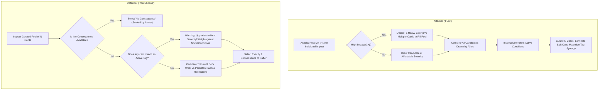

# Player's Guide Patch: The Strategy of Consequences

Patch and companion guide for `design/rules/players-guide.md`, integrating the **Consequence Pool & Tag Escalation Engine**.

---

## 1. The Dynamic of "I Cut, You Choose"

The consequence system transforms action resolution from passive damage calculation into an active psychological duel between attacker and defender. In every combat exchange, players experience both sides of this dynamic:

- **As the Attacker ("I Cut")**: You spend the Impact your attack generated to draw candidate consequence cards, and then curate a pool of $N$ cards tailored to exploit your opponent's vulnerabilities.
- **As the Defender ("You Choose")**: You assess the curated pool of $N$ cards and decide which cost to absorb, weighing immediate tactical survival against long-term attrition and deadly condition cascades.

---

## 2. Attacker Strategy: Curating the Consequence Pool ("I Cut")

When your attack forces an opponent to flip cards from their deck, each card flipped gives you **1 Impact** to spend as currency.

### Allocation: High-Ceiling Strikes vs. Pool Saturation

A critical tactical decision is how to spend your Impact when you generate a high number (such as 3, 4, or 5 Impact):

- **The High-Ceiling Strike (Concentrated Severity)**:
  - _Example_: Spending 4 Impact to draw a single **Severity 4** card (`Unconscious`, `Mortal Bleedout`).
  - _Tactical Value_: Enormous if the defender's pool is small or already filled by allies. However, against an armored defender with Pool Size $N = 3$ or higher, drawing only one card leaves the remaining slots implicitly filled with **"No Consequence"**—allowing the defender to simply ignore the blow!
- **Pool Saturation (Guaranteed Floor)**:
  - _Example_: An attacker who generated 4 Impact against an armored foe ($N = 3$) chooses to spend it as **$2 + 2$** (two Severity 2 cards) rather than a single Severity 4.
  - _Tactical Value_: When combined with an ally's 1-Impact attack (drawing a Severity 1 card), the candidate pool now contains `{Sev 2, Sev 2, Sev 1}`. All 3 slots of the armor are filled. The defender cannot pick "No Consequence" and is forced to accept at least a tactical impairment.

### Intra-Tier Curation: Filtering Out the Easy Outs

Not all consequences within the same severity tier are equally harmful in every situation:

- In **Severity 1**:
  - `Near Miss` resolves with no lingering effect.
  - `Out of Breath` injects immediate `Fatigue` onto the draw deck.
  - `Poor Footing` increases the Impact of all future defenses by +1.
  - `Dust in Eyes` completely prevents playing Defend cards from hand.
- In **Severity 2**:
  - `Strained Offense` penalizes attacking actions.
  - `Rattled Guard` strips armor thresholds.
  - `Afraid` restricts forward movement and engagement.

When multiple attackers target the same foe, their individual draws often produce **surplus candidate cards** (e.g., drawing 4 or 5 candidates when the pool size $N = 3$).

> **The Power of the Cut:** Having surplus draws allows the attacking team to **curate away "soft" options** (like `Near Miss`) and populate the pool exclusively with the most punishing, situationally crippling options. Forcing a defender to choose between two Severity 2 injuries and one hand-picked, brutal Severity 1 card (`Dust in Eyes` or `Poor Footing`) creates immense tactical pressure.

#### Using Printed Priority Numbers

Every consequence card features a printed **`Priority` rating (1 to 5)** representing its baseline disruption within that tier.

- While a GM or digital tool uses Priority to quickly default to the worst option, player attackers can go deeper: **situational context trumps generic priority**.
- _Example_: A Priority 4 card that penalizes movement might be a minor inconvenience to a stationary archer, but devastating to an agile skirmisher. Look past the printed number to attack your specific opponent's build and game plan!

### Hunting Tag Synergies & Escalation Hooks

The primary engine of lethality in CardPG is not raw severity, but **Tag Escalation**.

1. **Scan Active Conditions**: Always inspect the condition cards already in play in front of the defender.
2. **Match Incoming Tags**: If the defender is already `Off Balance` (Tag: `positioning`), offering even a Severity 1 `Poor Footing` (Tag: `positioning`) threatens an immediate escalation trigger into Severity 2 or 3.
3. **The Dilemma Trap**: Present the defender with a matching tag alongside an alternative high-severity injury. If they pick the matching tag, their existing condition upgrades; if they pick the alternative, they take a fresh, heavy penalty.

### Coordinated Party Assaults

Because each attacker spends their own Impact, party members should coordinate the types of candidate decks they draw from:

- **The Vanguard (Heavy Strike)**: Generates 3–4 Impact, drawing high-severity cards or multiple Severity 2 cards.
- **The Skirmisher / Flanker**: Generates 1–2 Impact, drawing from specialized condition decks (Positioning, Bleeding, Sensory).
- **The Assembly**: Together, the party pools their drawn candidates and selects the exact $N$ cards that corner the boss into an inescapable tactical bind.

---

## 3. Defender Strategy: Suffering the Cost ("You Choose")

When you are presented with a curated consequence pool, you must choose exactly 1 consequence to suffer (or "No Consequence" if an empty slot remains).

### Evaluating Intra-Tier Costs: Transient vs. Persistent

When presented with multiple cards of the same tier (e.g., two Severity 1 cards):

1. **Transient Deck Pollution (`Out of Breath`, `Shallow Laceration`)**:
   - These cards resolve immediately, adding `Fatigue` or `Minor Wound` to your deck or expended pile, and do not remain on the table.
   - _Best Chosen When_: You need full tactical freedom _right now_ to finish the fight or maneuver out of danger, and your current deck can absorb a little wear before reshuffling.
2. **Persistent Tactical Hindrance (`Poor Footing`, `Dust in Eyes`, `Rattled Guard`)**:
   - These remain on the table, actively penalizing your actions, defenses, or card plays until cleared.
   - _Best Chosen When_: The specific restriction doesn't hinder your current plan (e.g., taking `Strained Offense` if you intend to spend next round retreating or casting a spell rather than making weapon attacks).

### The Escalation Trap: When Lower Severity Is More Lethal

Never choose a consequence based solely on its printed severity number. A Severity 1 card can be far more dangerous than a Severity 2 card if it triggers an **`escalate:`** clause on a condition already on the table:

- **Scenario**: You have an active `Bleeding Cut` (Severity 2, Tag: `bleeding`). The attacker presents `{Broken Rib (Sev 2, Blunt), Shallow Laceration (Sev 1, Bleeding)}`.
- **The Trap**: Choosing `Shallow Laceration` because it is "only Severity 1" matches the `bleeding` tag on your active condition, immediately upgrading your injury to **`Arterial Hemorrhage` (Severity 3)**!
- **The Correct Play**: Suffer the novel `Broken Rib` (Severity 2). You now have two distinct Severity 2 conditions, but you have successfully avoided a catastrophic Severity 3 bleedout.

### Balancing In-Combat Actions vs. Post-Combat Tasks

Every persistent condition card features two recovery pathways:

- **Action (In-Combat)**: High cost, high friction (spending large color amounts, tucking cards under the condition to suppress it, or taking immediate fatigue).
- **Task (Out-of-Combat)**: Reasonable skill checks, narrative time (minutes or hours), and required tools (bandages, repair kits).

When choosing between two conditions, evaluate whether your character has the tools or team members to resolve the out-of-combat Task. A condition that can be safely bandaged in 5 minutes after combat is often vastly preferable to one requiring specialized surgery tools or hours of bed rest.

---

## 4. Quick-Reference: The Decision Checklist

