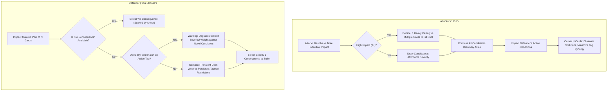

# Player's Guide Patch: The Strategy of Consequences

Patch and companion guide for `design/rules/players-guide.md`, integrating the **Consequence Pool & Tag Escalation Engine**.

---

## 1. The Dynamic of "I Cut, You Choose"

The consequence system transforms action resolution from passive damage calculation into an active psychological duel between attacker and defender. In every combat exchange, players experience both sides of this dynamic:

- **As the Attacker ("I Cut")**: You spend the Impact your attack generated to draw candidate consequence cards, and then curate a pool of $N$ cards tailored to exploit your opponent's vulnerabilities.
- **As the Defender ("You Choose")**: You assess the curated pool of $N$ cards and decide which cost to absorb, weighing immediate tactical survival against long-term attrition and deadly condition cascades.

---

## 2. Attacker Strategy: Curating the Consequence Pool ("I Cut")

When your attack forces an opponent to flip cards from their deck, each card flipped gives you **1 Impact** to spend as currency.

### Allocation: High-Ceiling Strikes vs. Pool Saturation

A critical tactical decision is how to spend your Impact when you generate a high number (such as 3, 4, or 5 Impact):

- **The High-Ceiling Strike (Concentrated Severity)**:
  - _Example_: Spending 5 Impact to draw a single **Severity 5** card (`Unconscious`, `Mortal Bleedout`).
  - _Tactical Value_: Enormous if the defender's pool is small or already filled by allies. However, against an armored defender with Pool Size $N = 3$ or higher, drawing only one card leaves the remaining slots implicitly filled with **"No Consequence"**—allowing the defender to simply ignore the blow!
- **Pool Saturation (Guaranteed Floor)**:
  - _Example_: An attacker who generated 4 Impact against an armored foe ($N = 3$) chooses to spend it as **$2 + 2$** (two Severity 2 cards) rather than a single Severity 4.
  - _Tactical Value_: When combined with an ally's 1-Impact attack (drawing a Severity 1 card), the candidate pool now contains `{Sev 2, Sev 2, Sev 1}`. All 3 slots of the armor are filled. The defender cannot pick "No Consequence" and is forced to accept at least a tactical impairment.

### Intra-Tier Curation: Filtering Out the Easy Outs

Within **Tier 1 (Tactical Impairments & Setbacks)**, cards feature an intentional **dynamic range**:

- **Softer / Clearable Band (Priority 1–3)**:
  - `Poor Footing`: Increases defensive Impact by +1; clearable mid-combat by tucking 2 cards from hand.
  - `Dust in Eyes`: Disables hand defense; clearable immediately via _Rub & Blink_ (costs 1 Pain card).
  - `Winded`: Attack declarations cost 1 Fatigue; clearable by spending Red 10.
  - `Rattled Nerves`: Start of round discards 1 card; clearable by spending Blue 15.
- **Sharp / Punishing Band (Priority 4–5)**:
  - `Off Balance`: Cannot Move or play Defend from hand; defenses suffer +1 Impact.
  - `Afraid`: Must expend 1 card from hand to attack or move closer.
  - `Rattled Guard`: Strips your armor's first Pierce threshold.
  - `Strained Offense`: Must expend 1 card from hand to declare an Attack Action.
  - `Bleeding Cut`: Heavy defenses expend extra cards from the draw deck.

When attackers generate surplus Impact above the defender's pool size ($N$), they produce **surplus candidate cards** (e.g., generating 5 Impact against $N = 3$ draws five Tier 1 cards).

> **The Power of the Cut:** Having surplus draws allows the attacking team to **curate away the softer, clearable options** (like `Poor Footing` or `Winded`) and populate the pool exclusively with the most punishing, situationally crippling options (`Off Balance`, `Afraid`, `Rattled Guard`).

#### Defensive Hand Strategy: Curation Denial

This dynamic range gives defenders a vital reason to play **Defend** cards from hand, even when an attack is too strong to soak completely:

- **Scenario**: You wear Padded Gambeson ($N = 3$). An incoming strike threatens to generate **5 Impact**.
- **If you hoard your cards**: The attack lands for 5 Impact. The attacker draws 5 candidates, discards all soft setbacks, and forces you to choose between `[Off Balance, Afraid, Rattled Guard]`. You suffer a crushing tactical lock.
- **If you play a Defend card**: Your hand defense shaves the attack from 5 Impact down to **3 Impact**. The attacker can now only afford 3 Tier 1 candidates—**zero surplus curation**. The drawn cards are `[Poor Footing, Winded, Off Balance]`. You select `Poor Footing` and clear it on your next turn.
- **The Takeaway:** Hand defense is not just about avoiding consequences; **it is about denying the attacker curation control and preserving your soft exits.**

#### Using Printed Priority Numbers

Every consequence card features a printed **`Priority` rating (1 to 5)** representing its baseline disruption within that tier.

- While a GM or digital tool uses Priority to quickly default to the worst option, player attackers can go deeper: **situational context trumps generic priority**.
- _Example_: A Priority 4 card that penalizes movement might be a minor inconvenience to a stationary archer, but devastating to an agile skirmisher. Look past the printed number to attack your specific opponent's build and game plan!

### Hunting Tag Synergies & Escalation Hooks

The primary engine of lethality in CardPG is not raw severity, but **Tag Escalation**.

1. **Scan Active Conditions**: Always inspect the condition cards already in play in front of the defender.
2. **Match Incoming Tags**: If the defender already has `Poor Footing` (Tag: `positioning`), offering another `positioning` card (`Off Balance` or even another `Poor Footing`) triggers an immediate escalation upgrade into `Off Balance` (Tier 1) or `Knocked Prone` (Tier 2).
3. **The Dilemma Trap**: Present the defender with a matching tag alongside an alternative high-priority lock. If they pick the matching tag, their existing condition upgrades; if they pick the alternative, they take a fresh, heavy penalty.

### Coordinated Party Assaults

Because each attacker spends their own Impact, party members should coordinate the types of candidate decks they draw from:

- **The Vanguard (Heavy Strike)**: Generates 3–4 Impact, drawing Tier 2/3 cards or multiple Tier 1 cards to saturate armor.
- **The Skirmisher / Flanker**: Generates 1–2 Impact, drawing from specialized condition decks (Positioning, Bleeding, Sensory).
- **The Assembly**: Together, the party pools their drawn candidates and selects the exact $N$ cards that corner the boss into an inescapable tactical bind.

---

## 3. Defender Strategy: Suffering the Cost ("You Choose")

When you are presented with a curated consequence pool, you must choose exactly 1 consequence to suffer (or "No Consequence" if an empty slot remains).

### Evaluating Intra-Tier Costs: Clearable vs. Stiff Locks

When presented with multiple Tier 1 options:

1. **Clearable Setbacks (`Poor Footing`, `Winded`, `Dust in Eyes`)**:
   - These impose active penalties on the table, but feature accessible in-combat recovery actions (tucking cards, rubbing eyes, taking a breath).
   - _Best Chosen When_: You have spare actions or cards to clear them promptly before enemies can target their tags for escalation.
2. **Stiff Tactical Locks (`Off Balance`, `Afraid`, `Rattled Guard`)**:
   - These severely restrict your turn economy or strip defensive coverage.
   - _Best Chosen When_: The specific restriction doesn't hinder your current plan (e.g., taking `Strained Offense` if you intend to spend next round retreating or casting a spell rather than making weapon attacks).

### The Escalation Trap: When Lower Severity Is More Lethal

Never choose a consequence based solely on its printed severity number. A Tier 1 card can be far more dangerous than a Tier 2 card if it triggers an **`escalate:`** clause on a condition already on the table:

- **Scenario**: You have an active `Bleeding Cut` (Tier 1, Tag: `bleeding`). The attacker presents `{Cracked Ribs (Tier 2, Torso), Bleeding Cut (Tier 1, Bleeding)}`.
- **The Trap**: Choosing `Bleeding Cut` because it is "only Tier 1" matches the `bleeding` tag on your active condition, immediately upgrading your injury to **`Deep Laceration` (Tier 2)** or **`Arterial Hemorrhage` (Tier 3)**!
- **The Correct Play**: Suffer the novel `Cracked Ribs` (Tier 2). You now have two distinct conditions, but you have successfully avoided an acute vascular crisis.

### Balancing In-Combat Actions vs. Post-Combat Tasks

Every persistent condition card features two recovery pathways:

- **Action (In-Combat)**: High cost, high friction (spending large color amounts, tucking cards under the condition to suppress it, or taking immediate fatigue).
- **Task (Out-of-Combat)**: Reasonable skill checks, narrative time (minutes or hours), and required tools (bandages, repair kits).

When choosing between two conditions, evaluate whether your character has the tools or team members to resolve the out-of-combat Task. A condition that can be safely bandaged in 5 minutes after combat is often vastly preferable to one requiring specialized surgery tools or hours of bed rest.

---

## 4. Quick-Reference: The Decision Checklist

