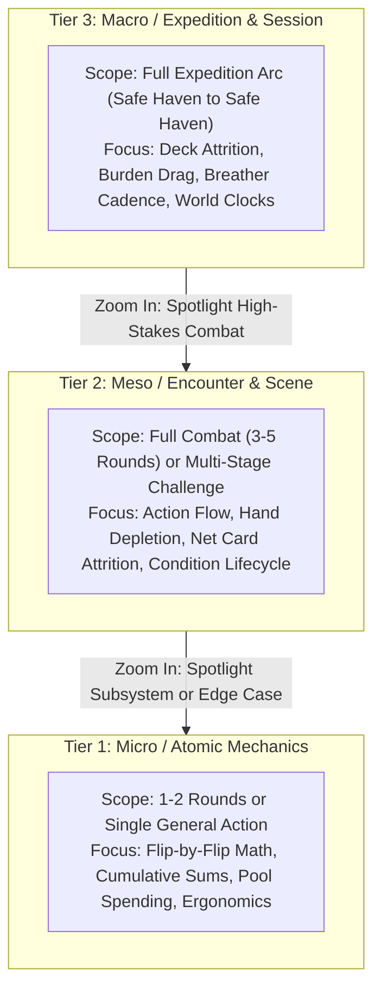

# Specification: Multi-Resolution Gameplay Trace Standards

## Purpose of this Standard

In _caRdPG_, player stamina, capabilities, physical trauma, and equipment are represented symmetrically through stateful 24-card decks, discard piles, and on-table condition cards. Because character performance is path-dependent (choices in round 1 affect deck composition in round 4, which affects survival in an Effort Cycle an hour later), **gameplay traces are the project's primary empirical design instrument**.

However, writing out every card flip, cumulative sum, and pool curation for an entire 3-hour session produces unreadable, unmaintainable 8,000-line traces. Conversely, high-level narrative summaries omit the exact mathematical break-points, card-counting hazards, and hand-flow bottlenecks that break games at the table.

This specification establishes a **three-tier resolution framework** for gameplay traces, standardized state ledgers, and conventions for **fractal spotlights**.

---

## 1. The Three Trace Resolutions

---

### Tier 1: Micro / Atomic Traces ("Card-by-Card Engine Benchmark")

- **Target Scope:** 1–2 rounds of Crisis Time, or a single complex General Action (e.g. the benchmarks in [non-combat-scenarios.md](non-combat-scenarios.md)).
- **Granularity Level:** **Absolute mechanical fidelity.**
  - Exact hand cards listed with printed color values (`{Red: 2, Yellow: 3, Blue: 1}`).
  - Flip-by-flip deck reveals with running cumulative color sums.
  - Explicit Impact calculation: $\text{Impact} = \lfloor (\text{Effective Strength} - \text{Defense}) / \text{Scale} \rfloor$.
  - Exact candidate consequence card draws, cost spending from the Impact budget, and the "I Cut, You Choose" pool presentation.
  - Exact table placement of resulting Condition cards.
- **Primary Questions Answered:**
  - Do the printed card stats and color splits generate the expected probability curves?
  - Does the Impact spending formula produce interesting, non-trivial player choices?
  - Are there card-counting exploits, degenerate stalling loops, or dead math steps?
  - Is tabletop physical handling (drawing, flipping, tucking) smooth or cumbersome?

---

### Tier 2: Meso / Tactical Encounter Traces ("Action & Consequence Flow")

- **Target Scope:** An entire Crisis Time combat (3–5 rounds) or a structured multi-stage challenge (an infiltration, a chase, an extended laboratory synthesis, or an opposed cell interrogation).
- **Granularity Level:** **Action and consequence aggregation.**
  - Individual flips are abstracted into **net card throughput and color totals**:
    > _"Carolyn plays Shield Slam from hand (investing 1 card). Target flips 3 cards totaling 7 Red, generating 2 Impact. Carolyn spends 2 Impact on `Knocked Prone` (Tier 2). Target chooses `Knocked Prone`."_
  - Focuses on tactical decisions, card economy deltas, hand depletion across rounds, and condition tag escalation (`Poor Footing` $\to$ `Off Balance` $\to$ `Knocked Prone`).
  - Concludes each round with an **End-of-Round State Snapshot**.
- **Primary Questions Answered:**
  - How many rounds does an encounter last before morale breaks or combatants drop?
  - Do players run out of cards in hand by Round 3, and does the hand-refill mechanic feel earned?
  - Do conditions actively change tactical incentives, or do players ignore them?
  - When and how does the encounter achieve decisive termination?

---

### Tier 3: Macro / Expedition & Session Traces ("Lifecycle & World Clocks")

- **Target Scope:** An entire adventuring "day" or expedition arc (Departure from Haven $\to$ Overland March $\to$ Exploration & Hazards $\to$ Skirmish $\to$ Breather $\to$ Boss Crisis $\to$ Retreat $\to$ Downtime Recovery).
- **Granularity Level:** **Scene input/output accounting.**
  - Encounters and hazards are treated as black/grey boxes characterized by net resource deltas:
    - Net cards burned from deck / reshuffles triggered.
    - Fatigue and Minor Wound status cards injected into character decks.
    - Lingering conditions gained or treated (`Sprained Ankle`, `Rattled Nerves`).
    - Consumables expended (rations, torches, bandages, alchemical tonics, gold).
    - Location Deck progression and Front Clock ticks.
  - Employs the standardized **Character Deck Ledger** at every scene transition.
- **Primary Questions Answered:**
  - **The Expedition Endurance Budget:** Can a standard 24-card deck sustain the target adventuring workload (e.g. 1 overland march, 2 hazards, 1 skirmish, 1 boss crisis) before exhaustion?
  - **Burden Drag:** Does heavy armor (Burden 2–3) accumulate fatigue so much faster than light gear (Burden 0) that it organically limits dungeon depth without an organized supply train?
  - **The Breather Economy:** Is taking a 15-minute [The Breather](../rules/modules/the-breather.md) worth advancing a ticking Front Clock?
  - **Domain Decoupling & Harm Bleed:** Do non-combat setbacks (fatigue, social embarrassment, lost gear) create plausible pressure in combat without lethal death spirals?

---

## 2. Standardized Notation & The State Ledger

To keep traces comparable and machine-auditable, all Tier 2 and Tier 3 traces must employ standardized notation.

### Character Deck Ledger Format

At each scene boundary (and optionally at end-of-round milestones in Tier 2), include a Markdown ledger table:

| PC              | Burden | Deck Breakdown (Clean / Fatigue / Wounds) | Hand / Guard | Table Conditions          | Consumables / Notes              |
| :-------------- | :----: | :---------------------------------------: | :----------: | :------------------------ | :------------------------------- |
| **Sir Carolyn** |   2    |           16 / 3 / 1 (20 total)           |   3 Ready    | `Bruised Ribs` (Tier 1)   | 1 Bandage used; 1 Breather taken |
| **Corin**       |   0    |           22 / 1 / 0 (23 total)           |   4 Ready    | None                      | 1 Piton expended                 |
| **Vespera**     |   0    |           19 / 2 / 0 (21 total)           |   2 Ready    | `Mental Burnout` (Tier 1) | 1 Reagent vial depleted          |

- **Deck Breakdown Syntax:** `Clean / Fatigue / Minor Wounds (Current Remaining Total)`. Note that "Clean" denotes uncorrupted action cards.
- **Hand / Guard:** Number of cards currently held in hand or placed as Face-Up Guard on the table.
- **Table Conditions:** Persistent Tier 1–3 Condition cards currently active in the character's play area.

### World State Banner

Accompanying each ledger, record the environmental and temporal state:

> **World State:** `Location: Room 4 (Flooded Vault)` | `Dungeon Clock: Tick 4/6` | `Front Clock: "The Coven Awakes" [■■□□□]` | `Elapsed Time: 2h 15m`

---

## 3. The "Fractal Spotlight" Pattern

A trace document does not need to remain locked to a single resolution tier throughout. Designers should employ **Fractal Spotlighting**:

1. Frame the entire adventure as a **Tier 3 Macro Trace** to establish the long-term endurance context.
2. When the party encounters a **new or critical subsystem** under active iteration (e.g. a novel non-combat hazard, an experimental opposed social mechanic, or a boss fight with complex tags), **zoom into Tier 2 or Tier 1** for that specific scene.
3. Once that encounter resolves, record the ledger outputs and **zoom back out to Tier 3** for subsequent exploration and recovery.

This pattern allows designers to test micro-level mechanics within the realistic macro-level wear and tear of an actual adventuring day, without wasting time writing hundreds of lines for routine encounters.

---

## 4. Trace Review & Audit Checklist

When evaluating any completed gameplay trace, verify the following:

|   #   | Check                        | Key Question                                                                                                                                                               |
| :---: | :--------------------------- | :------------------------------------------------------------------------------------------------------------------------------------------------------------------------- |
| **1** | **Resolution Discipline**    | Does the trace maintain its chosen resolution tier without lapsing into vague, unquantified narrative prose?                                                               |
| **2** | **Conservation of Cards**    | Are all card draws, flips, tucks, discards, and reshuffles mathematically conserved? Does deck size + discard + hand + table equal the starting deck + added status cards? |
| **3** | **Burden Accountability**    | Did heavily armored characters suffer proportional Fatigue on Effort Cycles and Breathers as dictated by their Burden score?                                               |
| **4** | **Clock Pressure Integrity** | Did non-combat delays (searching rooms, picking locks, taking 15-minute Breathers) cause appropriate advancement on Dungeon and Front Clocks?                              |
| **5** | **Harm Coherence**           | Are injuries, conditions, and mental tolls consistent with the domain of the challenge (verifying [non-combat-scenarios.md](non-combat-scenarios.md) Rule 5)?              |
