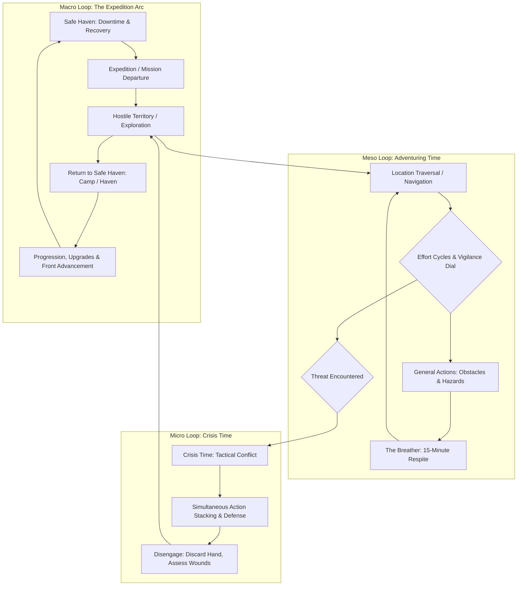

# Design Brief: Macro Structure, Session Cadence, and Campaign Roadmap

## Purpose of this Working Session Track

To articulate and document the **macro-level gameplay loop** of _caRdPG_—connecting micro-level resolution (Crisis Time rounds and General Actions) and meso-level exploration (Location Decks, Effort Cycles, and Breathers) into a cohesive **session and campaign lifecycle**.

While the card engine for tactical encounters is deeply developed, much of the structural knowledge regarding how an entire session flows, how campaigns progress, and how character decks recover across expeditions currently exists primarily as unwritten author intent. This brief seeds the session track to formalize that roadmap in the repository.

---

## 1. The Three-Tier Gameplay Architecture

_caRdPG_'s mechanical engine operates on three distinct timescales:

---

## 2. Key Tensions & Settled Findings from Empirical Traces

### Tension 1: The Expedition Endurance Budget — [SETTLED]

- **Finding:** Validated in [macro-gauntlet-expedition-trace.md](macro-gauntlet-expedition-trace.md) and [trace-climactic-boss-8-rounds.md](trace-climactic-boss-8-rounds.md).
- A standard 24-card deck sustains **40–55 cards of churn per adventuring day** (1 overland march, 1–2 obstacles, 1 skirmish, 1 Breather, and 1 climactic crisis).
- **The Fatigue Baseline:** A hard day naturally pushes **every character through 1 to 2 Fatigue Cycles** (or Heavy Exertion Breathers):
  - **Burden 0 (Light/Unarmored):** Ends the day with **2–4 Fatigue cards** (~10–15% deck dilution).
  - **Burden 2 (Heavy Armor):** Incurs $+ \text{Burden}$ on every cycle, ending with **5–8 Fatigue cards** (~25–30% deck dilution).
- **Exploration Gating:** Heavy armor provides high tactical combat resilience (Pool Size 4), but organically limits expedition depth without an organized supply train.

### Tension 2: Recovery, Downtime, and Harm Healing — [SETTLED]

- **Status Cards (In-Deck):**
  - _Fatigue Cards:_ Represent transient physical stamina. Cleared completely overnight in a **Safe Haven** (tavern, permanent camp, warm meal).
  - _Minor Wound Cards:_ Represent physical trauma. Cannot be cleared overnight in the field; remain in deck for ~1 in-game week until medical downtime/healing. In the field, first aid poultices apply a `Bandaged` tag suppressing bleed triggers.
- **Condition Cards (On-Table):**
  - _Tier 1 Conditions (`Bruised Shins`, `Mental Strain`):_ Clear with 1 night of restful sleep.
  - _Tier 2 Conditions (`Strained Shoulder`, `Severed Tendon`):_ Require 2–3 days of dedicated medical/bonesetter care in a Safe Haven.

### Tension 3: The Campaign Fronts & World Clock Integration — [SETTLED]

- **The Breather Economy:** Taking a 15-minute [The Breather](../rules/modules/the-breather.md) to reset decks advances the campaign **Front Clock by 1 tick**.
- **Retreat Cost:** Retreating early from an expedition to recover advances the enemy Front Clock by **2 ticks**, creating meaningful strategic pressure.

### Tension 4: Character Progression and Deck Upgrading — [OPEN]

- How card numbers are upgraded and new Action Cards/Traits acquired post-expedition remains to be formalized.

---

## 3. Scope and Next Actions

With empirical models completed, the roadmap moves directly to formalizing rules:

1. **Rulebook Framework:** Draft `design/rules/expeditions-and-downtime.md` codifying the macro loop, Safe Haven procedures, and recovery timelines.
2. **GM Campaign Guide Expansion:** Formalize Front advancement pacing tables in [gamemaster-guide.md](../rules/gamemaster-guide.md) Part 3.

---

## 4. Session Track Deliverables

- [ ] **1. Framework Document:** `design/rules/expeditions-and-downtime.md` (Formalizing the macro loop, recovery procedures, and Safe Haven mechanics).
- [ ] **2. Campaign Progression Guide:** Expanding [gamemaster-guide.md](../rules/gamemaster-guide.md) Part 3 with campaign pacing tables, Front advancement formulas, and deck advancement benchmarks.
- [x] **3. Multi-Resolution Trace Suite (COMPLETED):**
  - [gameplay-trace-standards.md](gameplay-trace-standards.md) (Standardizing Micro, Meso, Macro trace fidelity and state ledgers).
  - [macro-gauntlet-expedition-trace.md](macro-gauntlet-expedition-trace.md) (Full-day expedition trace proving the 24-card budget, Breathers, and Burden drag).
  - [trace-climactic-boss-8-rounds.md](trace-climactic-boss-8-rounds.md) (8-round climactic crisis testing the Turn Horizon, mid-combat Fatigue Cycles, and Pass-to-Charge economy).
