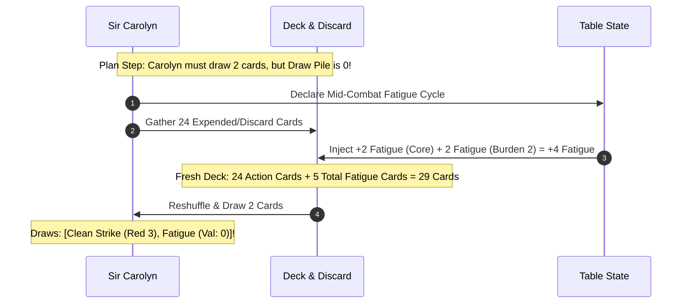

# Play Trace: The Sunken Matron (8-Round Climactic Boss Crisis)

## Purpose & Systems Under Test

This document is a **Tier 2 (Meso) Tactical Encounter Trace** testing an extended, high-stakes boss battle over **8 rounds of Crisis Time**.

Unlike basic skirmishes where fighters trade cheap Cost 0–1 actions each round, this trace explicitly exercises the **high-cost action economy** seen in canonical PC decks (e.g. [`wizard.yaml`](../../data/cards/pc/wizard.yaml), [`shield-fighter.yaml`](../../data/cards/pc/shield-fighter.yaml), [`culorn.yaml`](../../data/cards/pc/culorn.yaml)):

1. **The "Pass to Charge" Economy:** Showing how combatants voluntarily **Pass** for 1–2 rounds to accumulate a 5–6 card hand, enabling massive **Cost 3–5 signature attacks** (`Rend Spirit`, `Unstoppable Chop`, `Fireball`).
2. **Detonation Spikes (Strength 18–25+):** Demonstrating how stacked resource cards generate explosive Strength, forcing defenders to flip 6–10 cards and producing massive Impact spikes that shatter wards and bypass defenses.
3. **Tactical Peeling & Synergy:** How martial defenders (Sir Carolyn) spend their actions peeling and shielding fragile casters (Vespera) while they gather arcane charge.
4. **The Turn Horizon & Fatigue Dilution:** Tracking how these heavy card expenditures accelerate deck churn, triggering mid-combat Fatigue Cycles and forcing combatants to finish the battle "fighting on fumes" in Rounds 6–8.

---

## Combatants & Tactical Setup

### The Adventuring Party (Pre-Boss Wear)

The party breaches the Flooded Sanctum after dungeon exploration with partially depleted draw piles:

- **Sir Carolyn (Shield-Fighter):**
  - Deck based on [`shield-fighter.yaml`](../../data/cards/pc/shield-fighter.yaml): Martial/Defensive (`12 Red`, `8 Yellow`, `4 Blue`).
  - Signature Cards: `Unstoppable Chop` (Cost 3, Red Str = Red + 5), `Make Opportunity` (Defend: use as resource to attack next turn), `Shielded Stance`, `Shield Sacrifice`.
  - Armor: `Tempered Plate & Chain` (Pool Size $N=4$, Burden **2**), `Reinforced Kite Shield`.
  - **Starting State:** 18 cards in draw pile, 6 cards in discard, **1 Fatigue card** in deck. Hand: 2 Ready cards.
- **Corin (Swashbuckler):**
  - Deck based on [`swashbuckler.yaml`](../../data/cards/pc/swashbuckler.yaml): Finesse/Agile (`6 Red`, `14 Yellow`, `4 Blue`).
  - Signature Cards: `Acrobatic Flank`, `Finesse Riposte`, `Heart-Seeking Thrust` (Cost 2, Yellow Str = Yellow + 3).
  - Armor: `Reinforced Gambeson` (Pool Size $N=2$, Burden **0**), `Dueling Rapier & Main-Gauche`.
  - **Starting State:** 20 cards in draw pile, 4 cards in discard, 0 Fatigue. Hand: 3 Ready cards.
- **Vespera (Scholar-Mage):**
  - Deck based on [`wizard.yaml`](../../data/cards/pc/wizard.yaml): Arcane/Intellect (`4 Red`, `6 Yellow`, `14 Blue`).
  - Signature Cards: `Rend Spirit` (Cost 4, Blue Str = Blue + 4), `Shield of Force` (Defend: recover all other cards used in defense), `Arcane Ward`.
  - Armor: `Academic Robes` (Pool Size $N=2$, Burden **0**), `Focus Staff`.
  - **Starting State:** 19 cards in draw pile, 5 cards in discard, 0 Fatigue. Hand: 2 Ready cards.

---

### The Boss: Morvath the Sunken Matron & The Brine Golem

```mermaid
graph TD
    subgraph BossEncounter [The Flooded Sanctum Arena]
        BG[Brine Golem<br/>16-Card Brute Deck | Burden 2<br/>Intercepts Melee Attacks]
        MM[Morvath the Sunken Matron<br/>32-Card Witchcraft Deck<br/>Active: Runic Hydro-Shield]
        FL[Rising Brine Tide<br/>Floods +1 level every 3 rounds]
    end

    Carolyn[Sir Carolyn] -->|Shields & Peels for| Vespera[Vespera]
    Vespera -->|Passes to Charge Cost 4 Bomb| MM
    Corin[Corin] -->|Harasses & Bypasses| BG
```

- **Morvath the Sunken Matron (32-card Deck):**
  - Consequence Pool Size: $N = 3$.
  - Protection: `Runic Hydro-Shield` (Absorbs up to 6 Impact from attacks; loses 2 absorption each time it suffers Blue arcane disruption).
- **The Brine Golem (16-card Construct Deck, Burden 2):**
  - Trait: `Living Bastion` (Intercepts physical attacks targeting Morvath).
- **Lair Clock: Rising Tide:**
  - _Round 3:_ Flooded knee-deep (+1 card cost to Yellow maneuvering).
  - _Round 6:_ Flooded waist-deep (-2 Strength to un-elevated physical melee).

---

## Round-by-Round Tactical Trace

---

### Act 1: The Gathering Charge & The Detonation (Rounds 1–3)

#### Round 1: Setting the Trap & Storing Fuel

- **Plan Step:** All combatants draw 2 cards.
  - Carolyn hand: 4 cards.
  - Corin hand: 5 cards.
  - Vespera hand: 4 cards (`Rend Spirit` [Cost 4], `Elven Lore` [Blue 5], `Book Learning` [Blue 6], `Force Dart` [Blue 3]).
- **Tactical Intent:**
  - Vespera holds `Rend Spirit` (Cost 4), but needs **5 cards in hand** to cast it (the spell $+ 4$ resource cards). She currently holds only 4 cards!
  - **Vespera declares: PASS.** She holds ground behind the altar pillar, chanting under her breath, conserving all 4 cards in hand.
  - Carolyn knows Vespera is preparing an arcane bomb. Carolyn plays `Shielded Stance` (enters defensive state) and holds position between the Brine Golem and Vespera.
  - Corin uses `Acrobatic Flank` (spends 1 Yellow card) to draw the Golem's attention.
  - Morvath channels _Torrent of Silt_: **Strength 8 Blue** targeting Vespera!
  - Brine Golem brings down a massive stone club at Carolyn: **Strength 9 Red**.
- **Resolution Step (Peeling for the Caster):**
  - **Morvath vs. Vespera:** Morvath's 8 Blue torrent surges toward Vespera. If Vespera defends from hand, she burns the fuel cards needed for `Rend Spirit`!
    - Carolyn reacts: uses `Lead with the Shield` (from her `Shielded Stance`) to **intercept the attack**!
    - Carolyn faces the 8 Blue: plays `Endure` (Blue 0, +4 defense bonus) + flips 2 cards (Blue 2, Blue 3 = 5 Blue, total 9).
    - Flipped 2 cards. Armor absorbs 2 Impact. **Vespera's hand remains completely untouched!**
  - **Golem vs. Carolyn:** Golem attacks for 9 Red. Carolyn plays `Shield Block` (Red 4 + 2 shield = 6 Red), flips 1 card (Red 4) $\to$ meets 10 Red. Flipped 1 card; 0 net Impact.
- **End of Round 1 State:**
  - Carolyn draw pile: $18 - 2\text{ (draw)} - 3\text{ (flips)} = 13$ cards.
  - Corin draw pile: $20 - 2 = 18$ cards. Hand: 4 cards.
  - Vespera draw pile: $19 - 2 = 17$ cards. **Hand: 4 cards preserved.**

---

#### Round 2: The Squeeze & Building the Hand

- **Plan Step:** All combatants draw 2 cards.
  - Vespera draws 2 cards $\to$ **Vespera now holds 6 cards in hand!** She has enough fuel to cast `Rend Spirit` next round!
  - **Vespera declares: PASS.** She continues channeling, calculating arcane vectors.
  - Carolyn plays `Make Opportunity` (Cost 0, Defend: can use this card as a resource to attack next turn) to prepare for a devastating counter-strike.
  - Corin attacks the Golem with `Hamstring Rapier` (**Strength 7 Yellow**).
  - Golem swings wildly at Carolyn: **Strength 8 Red**.
  - Morvath unleashes _Barbed Brine-Hooks_ at Corin: **Strength 7 Yellow**.
- **Resolution Step:**
  - Corin strikes Golem: Golem flips 3 cards (meets 7 Yellow). Takes 2 Impact $\to$ Corin inflicts Tier 1 **`Cracked Silt Core`** on Golem.
  - Morvath vs. Corin: Corin flips 2 cards (meets 7 Yellow). Gambeson absorbs 2 Impact. 0 net Impact.
  - Golem vs. Carolyn: Carolyn plays `Make Opportunity` (Red 3), flips 2 cards (meets 8 Red). Flipped 2 cards. Plate absorbs 2. `Make Opportunity` stays face up on table!
- **End of Round 2 State:**
  - Carolyn draw pile: $13 - 2 - 2 = 9$ cards left!
  - Corin draw pile: $18 - 2 - 2 = 14$ cards left.
  - Vespera draw pile: $17 - 2 = 15$ cards left. **Hand: 6 cards fully primed!**

---

#### Round 3: The Detonation — Cost 4 `Rend Spirit` (Strength 24 Blue!)

- **Plan Step:** All combatants draw 2 cards.
  - Vespera holds 8 cards in hand! The channel is complete.
- **Environmental Lair Clock Event:** **Tick 3/6 Triggers!** Water rushes in knee-deep. `[Flooded Knee-Deep]` active (+1 card cost to Yellow maneuvering).
- **Declarations:**
  - **Vespera unleashes the Bomb:** Plays **`Rend Spirit`** (Cost 4) targeting Morvath!
    - Top Card: `Rend Spirit` ({Blue: 4, Red: 2, Yellow: 2}, text: _"Str = {Blue} + 4"_).
    - Action Stack Fuel (4 cards paid from hand):
      1. `Book Learning` ({Blue: 6})
      2. `Elven Lore` ({Blue: 5})
      3. `Academy Politics` ({Blue: 5})
      4. `Force Dart` ({Blue: 3})
    - **Calculated Attack Strength:**
      $$\text{Total Blue} = 4\text{ (top)} + 6 + 5 + 5 + 3 = 23\text{ Blue}$$
      $$\text{Attack Strength} = 23 + 4\text{ (modifier)} = \mathbf{27\text{ Blue Strength!}}$$
  - Carolyn unleashes `Unstoppable Chop` (Cost 3) on the Brine Golem, using `Make Opportunity` from last round as free fuel. Stack deals **18 Red Strength**!
  - Morvath screams as the sanctum air ionizes with blinding azure witch-fire.
- **Resolution Step (The Explosion):**
  - **Vespera vs. Morvath:** Morvath faces **27 Blue Strength**!
    - Morvath's `Runic Hydro-Shield` can only absorb up to 6 Impact. Morvath must meet the remaining Strength from her 32-card deck!
    - Morvath flips cards from deck:
      - Flips 7 cards to scrape together 21 Blue.
      - Still 6 Blue short!
      - **Total Flipped Stack:** 7 cards $+ 6$ unmet $= \mathbf{13\text{ Raw Impact!}}$
    - **Impact Fallout:**
      1. The `Runic Hydro-Shield` absorbs 6 Impact and **instantly shatters into vaporized mist!**
      2. The remaining **7 Impact** punches directly into Morvath's unshielded body!
      3. Vespera spends 7 Impact:
         - Inflicts Tier 2 **`Ruptured Consciousness`** (Morvath is dazed; cannot channel spells next round).
         - Inflicts Tier 2 **`Soul Scour`** (Tags: `[arcane]`, `[vulnerable]`: all defenses suffer -2).
  - **Carolyn vs. Brine Golem:** Carolyn's 18 Red hammers the Golem. The Golem's remaining 10-card deck is completely emptied! **The Golem collapses into inert rubble!**
- **End of Round 3 State:**
  - Vespera burned **5 cards from hand** in one burst! Hand drops from 8 to 3 cards.
  - Morvath: `Runic Hydro-Shield` destroyed; suffered 2 Tier 2 conditions; burned 7 cards from deck.
  - Golem: Destroyed!

---

### Act 2: The Turn Horizon & Mid-Combat Fatigue (Rounds 4–5)

#### Round 4: The Reeling Matron & Carolyn's Wall

- **Plan Step:** All combatants draw 2 cards.
  - Carolyn draws 2 cards $\to$ **her draw pile has exactly 3 cards remaining!**
- **Declarations:**
  - Morvath, bleeding from eyes and ears (`Ruptured Consciousness`), cannot cast spells; she lashes out physically with her iron-tipped _Drowned Scepter_: **Strength 8 Red** targeting Carolyn.
  - Carolyn plays `Brace` (Red 3 + Shield 2 = 5 Red).
  - Corin vaults through the knee-deep surf to exploit Morvath's `[vulnerable]` tag: `Dagger Thrust` (**Strength 8 Yellow**).
  - Vespera passes this round to recover focus and survey the room.
- **Resolution:**
  - Morvath vs. Carolyn: Carolyn needs 3 Red from flips.
    - Flips her **final 3 cards** from her draw pile:
      - Flip 1: `Heavy Cleave` (Red 4) $\to$ Running Red: 9 (Met!).
      - Flip 2: `Fatigue` (Red 0!) _(Dead card!)_
      - Flip 3: `Unyielding` (Red 3).
    - **Carolyn's Draw Pile is now completely empty (0 cards)!**
    - Flipped 3 cards. Armor absorbs 2. Carolyn takes 1 Impact $\to$ takes Tier 1 **`Bruised Ribs`**.
  - Corin vs. Morvath: With Morvath's defenses weakened by `Soul Scour`, Corin's 8 Yellow generates 3 Impact $\to$ inflicts Tier 2 **`Severed Hamstring`** (Tags: `[mobility]`, `[bleeding]`).
- **End of Round 4 State:**
  - **Sir Carolyn:** Draw pile = **0 cards**! Discard pile = 24 cards (including 1 Fatigue card).
  - Corin draw pile: 10 cards left.
  - Vespera draw pile: 13 cards left.

---

#### Round 5: The Turn Horizon Breached! The Mid-Combat Reshuffle

- **The Dramatic Pivot:** Sir Carolyn begins Round 5 with an empty draw pile. She must draw 2 cards in the Plan Step.



- **Carolyn's Mid-Combat Fatigue Cycle:**
  1. Carolyn gathers her 24 discarded cards.
  2. Incurs an instant **Fatigue Cycle**: adds **2 Fatigue cards $+ 2$ Burden cards $= 4$ new Fatigue cards** into the deck!
  3. Total deck size is now **29 cards** (24 clean action cards $+ 5$ total Fatigue cards).
  4. Carolyn reshuffles thoroughly and draws her 2 cards:
     - Card 1: `Overpower` ({Red: 4})
     - Card 2: **`Fatigue`** ({Red: 0, Yellow: 0, Blue: 0}) — _A dead card in hand!_
- **Declarations:**
  - Morvath, desperate, summons a necrotic tidal burst: _Blood-Brine Geyser_ (**Strength 10 Red**).
  - Carolyn uses `Overpower` to parry (Red 4 + Shield 2 = 6 Red). Needs 4 Red from flips.
  - Corin plays `Finesse Riposte` (**Strength 8 Yellow**).
  - Vespera channels _Shatter Psyche_ (**Strength 9 Blue**).
- **Resolution (The Fatigue Dilution in Melee):**
  - Carolyn needs 4 Red. She flips the top cards of her freshly reshuffled 29-card deck:
    - Flip 1: **`Fatigue`** (Red 0!) $\to$ Running Red: 6 _(0 added!)_
    - Flip 2: `Arming Strike` (Red 2) $\to$ Running Red: 8
    - Flip 3: **`Fatigue`** (Red 0!) $\to$ Running Red: 8 _(Dead card!)_
    - Flip 4: `Iron Will` (Red 3) $\to$ Running Red: 11 (Met!).
  - **The Mechanical Toll of Fatigue:** What normally takes 1–2 flips required **4 flips** because 2 dead Fatigue cards were turned up!
  - Flipped 4 cards. Plate absorbs 4. Carolyn barely avoids damage, but burns cards at double speed.
  - Morvath takes hits from Corin and Vespera $\to$ burns 6 cards from her deck, suffering Tier 2 **`Exposed Flank`**.
- **End of Round 5 State:**
  - Carolyn: 23 cards in draw pile (diluted with 3 remaining Fatigue cards).
  - Corin: 6 cards left in draw pile.
  - Vespera: 9 cards left in draw pile.
  - Morvath: 12 cards left in deck. Conditions: `Severed Hamstring` (T2), `Exposed Flank` (T2), `Soul Scour` (T2).

---

### Act 3: Fighting on Fumes & The Climax (Rounds 6–8)

#### Round 6: Waist-Deep Flood & Morvath's Cost 4 Ritual

- **Plan Step:** All combatants draw 2 cards.
  - Corin draws his final 2 cards $\to$ **Corin's draw pile hits 0!**
  - **Corin's Fatigue Cycle (Burden 0):** Gathers 24 cards $+ 2$ Fatigue cards. Reshuffles 26-card deck.
- **Lair Clock Event:** **Tick 6/6 Triggers!** Water reaches waist level.
  - `[Flooded Waist-Deep]`: Physical attacks suffer **-2 Strength** unless elevated on altar stones.
- **Declarations:**
  - Morvath climbs the stone altar stairs (negating water penalty) and unleashes her ultimate stored spell: **`Drown the World` (Cost 4)**!
    - Stack size: 5 cards. Total Attack: **Strength 22 Blue** sweeping the entire chamber!
  - Vespera counters with **`Shield of Force`** (plays Staff + 2 Blue cards = 10 Blue defense; text: _recover all other cards used in defense_).
  - Carolyn braces against the altar pillar, holding her shield high to catch the cascading brine.
  - Corin scrambles onto a fallen statue to leap at Morvath.
- **Resolution:**
  - **Facing the 22 Blue Wave:**
    - Vespera meets 10 Blue from hand, flips 4 cards (meets 22 Blue). Thanks to `Shield of Force`, the 2 hand cards return to her hand!
    - Carolyn faces 22 Blue: flips 6 cards from her diluted deck (reveals 1 Fatigue, 5 clean) to meet 22.
    - Flipped 6 cards $\to$ plate absorbs 4 $\to$ Carolyn takes 2 Impact $\to$ takes Tier 2 **`Gasping for Air`** (cannot attack next round).
  - **Corin's Counter-Leap:** While Morvath's staff is lowered from casting, Corin leaps from the statue with `Heart-Seeking Thrust` (Cost 2 stack, Yellow 9).
    - Morvath flips her final 4 deck cards $\to$ **Morvath's deck completely empties!**
    - Corin inflicts 4 Impact $\to$ escalates `Exposed Flank` into Tier 3 **`Ruptured Guard / Pinned`**!
- **End of Round 6 State:**
  - Carolyn: 15 cards in draw pile. Active: `Gasping for Air` (T2), `Bruised Ribs` (T1).
  - Corin: 22 cards in draw pile (2 Fatigue).
  - Vespera: 3 cards left in draw pile (approaching her own Turn Horizon).
  - Morvath: **0 cards in deck! Deck out!** Pinned to the altar.

---

#### Round 7: The Execution Setup — Cost 3 `Unstoppable Chop`

- **Plan Step:** All combatants draw 2 cards.
  - Vespera draws her final cards $\to$ **Vespera hits her Fatigue Cycle (Burden 0)**, adding 2 Fatigue cards and reshuffling.
  - _All three PCs have now crossed their Turn Horizon!_
  - Morvath performs a Boss Fatigue Cycle, reshuffling with +3 Fatigue cards.
- **Declarations:**
  - Morvath, pinned and bleeding, attempts a frantic claw strike at Corin: **Strength 6 Red**.
  - Corin uses `Finesse Parry` (Yellow 4), easily meeting the claw.
  - Carolyn, recovering from `Gasping for Air`, climbs the altar steps. She gathers 4 cards from hand and prepares **`Unstoppable Chop` (Cost 3)**:
    - Top Card: `Unstoppable Chop` ({Red: 4, text: _"Str = {Red} + 5 → basic wound"_})
    - Resources (3 cards paid from hand):
      1. `Athletics` (Red 4)
      2. `Conditioning` (Red 4)
      3. `Pressing Attack` (Red 4)
    - **Calculated Strength:**
      $$\text{Total Red} = 4 + 4 + 4 + 4 = 16\text{ Red}$$
      $$\text{Attack Strength} = 16 + 5\text{ (modifier)} = \mathbf{21\text{ Red Strength!}}$$
- **Resolution:**
  - Carolyn brings down the massive overhand execution strike (21 Red) onto the pinned Matron.
  - Morvath attempts to defend with her diluted deck:
    - Flips 5 cards: reveals Red 2, **Fatigue (Red 0!)**, Red 1, Red 2, **Fatigue (Red 0!)** $\to$ total Red: 5.
    - Fails to meet 21 Red by 16 points!
    - Flipped 5 cards $+$ 16 unmet Strength $= \mathbf{21\text{ Raw Impact!}}$
  - **Catastrophic Tag Escalation:**
    - Carolyn spends the 21 Impact against Morvath's Tier 2 conditions (`Severed Hamstring` + `Ruptured Guard`).
    - Escalates into Tier 3 **`Shattered Spine`** and Tier 3 **`Mortal Exsanguination`**!
- **End of Round 7 State:**
  - Morvath lies broken on the altar, unable to act.

---

#### Round 8: Coup de Grâce & Draining of the Sanctum

- **Plan Step / Resolution:**
  - With Morvath at two Tier 3 conditions and 0 defense, Corin drives his rapier through her throat: **Tier 4 Fatal Trauma / Defeat**.
  - The Matron's body dissolves into black salt. The altar runes crack, and the rising tide rapidly drains through subterranean valves.
- **Crisis Ends.**

---

## Post-Combat Attrition Ledger

> **World State:** `Location: The Flooded Sanctum (Boss Vanquished)` | `Elapsed: 8 Rounds (~22 minutes table time)`

| PC              | Burden | Deck Breakdown (Clean / Fatigue / Wounds) | Ready Hand Post-Crisis | Active Conditions                                    |       Total Cards Cycled       |
| :-------------- | :----: | :---------------------------------------: | :--------------------: | :--------------------------------------------------- | :----------------------------: |
| **Sir Carolyn** |   2    |         23 / **5** / 0 (28 total)         |  0 (flushed at exit)   | `Bruised Ribs` (Tier 1), `Gasping for Air` (cleared) | **36 cards** (1 Fatigue Cycle) |
| **Corin**       |   0    |         24 / **2** / 0 (26 total)         |  0 (flushed at exit)   | None                                                 | **28 cards** (1 Fatigue Cycle) |
| **Vespera**     |   0    |         24 / **2** / 0 (26 total)         |  0 (flushed at exit)   | None                                                 | **29 cards** (1 Fatigue Cycle) |

---

## Key Systems Findings

### 1. Passing Transforms the Action Economy

- In Rounds 1–2, Vespera's decision to **Pass** allowed her to accumulate an 8-card hand.
- In Round 3, she spent 5 cards in a single round to detonate **`Rend Spirit` for 27 Blue Strength**.
- This created an authentic tabletop "boss phase transition": the 27 Blue blew away Morvath's 6-point shield and dealt 7 raw Impact in a single action, shifting the fight from defense to offense.

### 2. Tactical Peeling is Essential for Casters

- If Sir Carolyn had not spent her Round 1 action intercepting Morvath's 8 Blue attack with `Lead with the Shield`, Vespera would have been forced to defend from hand, burning 2–3 cards and delaying her bomb by two rounds.
- The fighter's value was not merely dealing damage, but **insulating the wizard's hand** so the team's artillery could fire.

### 3. Strength Spikes Create Massive Consequence Breakthroughs

- Routine attacks (Strength 7–9) chip away 1–2 Impact after armor soak.
- Heavy attacks (Strength 21–27) force defenders to flip 6–10 cards and create **7 to 21 Impact**, triggering dramatic condition leaps (`Soul Scour` $\to$ `Ruptured Guard` $\to$ `Shattered Spine`) that bring bosses down decisively.
