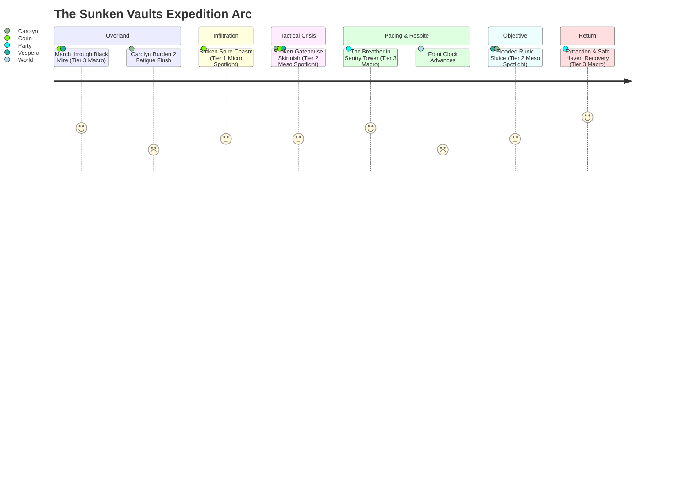

# Play Trace: The Sunken Vaults of Mor-Thal (Macro Expedition Gauntlet)

## Context & Purpose

This document is the first **multi-resolution expedition trace** for _caRdPG_, implementing the guidelines established in [gameplay-trace-standards.md](gameplay-trace-standards.md).

It validates:

1. **The Multi-Resolution Trace Framework:** Testing how seamlessly Tier 3 (Macro), Tier 2 (Meso), and Tier 1 (Micro) nest via **Fractal Spotlighting**.
2. **The Expedition Endurance Budget:** Measuring whether a 24-card deck can survive a typical multi-scene mission (overland march $\to$ environmental obstacle $\to$ tactical skirmish $\to$ short rest $\to$ timed dungeon puzzle $\to$ retreat).
3. **Burden Drag & Deck Dilution:** Directly contrasting an armored character (Burden 2) against light/unarmored characters (Burden 0) across multiple Effort Cycles and Breathers.
4. **Ludonarrative Harm Coherence:** Ensuring consequences incurred across environmental, martial, and analytical challenges do not trigger nonsensical cross-pillar penalties.

---

## The Adventuring Party

### 1. Sir Carolyn (Armored Knight & Shield-Fighter)

- **Archetype:** Heavily armored martial defender.
- **Deck (24 cards):** Martial / Resilient focus (`12 Red`, `8 Yellow`, `4 Blue`). Average Red: 3.2.
- **Equipment & Table Cards:**
  - `Tempered Plate & Chain` (Armor: Pool Size $N = 4$, Burden: **2**).
  - `Reinforced Kite Shield` (Tool/Defense: Grants +2 Red Strength when actively parrying).
  - `Arming Sword` (Weapon: Red Attack focus).
- **Starting State:** Clean 24-card deck, 0 Fatigue, 0 Conditions.

### 2. Corin (Swashbuckler & Infiltrator)

- **Archetype:** Finesse skirmisher and scout.
- **Deck (24 cards):** Agility / Acrobatics focus (`6 Red`, `14 Yellow`, `4 Blue`). Average Yellow: 3.4.
- **Equipment & Table Cards:**
  - `Reinforced Leather Gambeson` (Armor: Pool Size $N = 2$, Burden: **0**).
  - `Dueling Rapier & Main-Gauche` (Weapons: Yellow Attack/Defend focus).
  - `Mountaineer's Harness & Pitons` (Tool: Absorbs 3 Impact on physical climbing/traversal hazards).
- **Starting State:** Clean 24-card deck, 0 Fatigue, 0 Conditions.

### 3. Vespera (Scholar-Mage & Alchemist)

- **Archetype:** Intellect / Discipline specialist.
- **Deck (24 cards):** Arcane / Scholarly focus (`4 Red`, `6 Yellow`, `14 Blue`). Average Blue: 3.6.
- **Equipment & Table Cards:**
  - `Academic Robes & Traveling Cloak` (Armor: Pool Size $N = 2$, Burden: **0**).
  - `Alchemical Field Kit` (Tool: Grants +2 Blue Strength to chemical and wound treatments).
  - `Focus Staff` (Weapon/Tool: Blue focus).
- **Starting State:** Clean 24-card deck, 0 Fatigue, 0 Conditions.

### Shared Expedition Assets

- 3 Days Rations, 2 Torches, 1 Flask Alchemical Healing Salve, 50-ft Hemp Rope.

---

## Macro Arc Overview

---

## Scene 1: Departure & The Black Mire March

- **Resolution Tier:** **Tier 3 (Macro)**
- **Mode:** Adventuring Time (Overland Traversal)
- **Duration:** 2 hours of forced march through driving sleet and knee-deep fen muck.

### Exploration Decisions & Vigilance Dial

- **Corin (Scout):** Operates on point. Sets Vigilance Dial to **3 Ready Cards** (preserving fast reaction against ambushes).
- **Carolyn (Vanguard):** Carrying 45 lbs of steel plate. Sets Vigilance Dial to **1 Ready Card** (at ease to conserve energy).
- **Vespera (Rearguard):** Sets Vigilance Dial to **1 Ready Card** (studying the expedition map).

### Mechanical Resolution: The 1st Effort Cycle

After 90 minutes of wading through suction mud, the GM calls the **1st Effort Cycle**:

1. All characters flush their Ready Hands into their discard piles.
2. **Burden Check:**
   - **Corin (Burden 0):** Discards his 3 Ready Cards. Adds **0 Fatigue cards**. (Draw pile: 21 cards, Discard: 3 cards).
   - **Vespera (Burden 0):** Discards her 1 Ready Card. Adds **0 Fatigue cards**. (Draw pile: 23 cards, Discard: 1 card).
   - **Carolyn (Burden 2):** Discards her 1 Ready Card. Because her armor is **Burden 2**, she must immediately shuffle **2 Fatigue cards** into her discard pile! (Draw pile: 23 cards, Discard: 3 cards [1 clean action, 2 Fatigue]).

The party reaches the perimeter of the ancient sunken fortress.

### Scene 1 Ledger Snapshot

> **World State:** `Location: Outskirts of Mor-Thal` | `Dungeon Clock: Tick 1/6` | `Front Clock: "Coven of the Drowned" [□□□□□]` | `Elapsed: 2h 00m`

| PC              | Burden | Deck Breakdown (Clean / Fatigue / Wounds) | Ready Hand  | Table Conditions | Consumables / Notes         |
| :-------------- | :----: | :---------------------------------------: | :---------: | :--------------- | :-------------------------- |
| **Sir Carolyn** |   2    |   23 / 2 / 0 (25 total in deck+discard)   | 0 (flushed) | None             | Burden 2 injected 2 Fatigue |
| **Corin**       |   0    |   24 / 0 / 0 (24 total in deck+discard)   | 0 (flushed) | None             | Drew path through mire      |
| **Vespera**     |   0    |   24 / 0 / 0 (24 total in deck+discard)   | 0 (flushed) | None             | Conserved stamina           |

---

## Scene 2: The Broken Spire Chasm

- **Resolution Tier:** **Tier 1 (Micro Spotlight)**
- **Mode:** Adventuring Time (General Action)
- **Scenario Reference:** [non-combat-scenarios.md](non-combat-scenarios.md#scenario-1-the-broken-spire-chasm-environmental--hazard) (Scenario 1)

### Context & Narrative Stakes

The only entrance across the flooded moat into the fortress is a collapsed masonry aqueduct. A 10-meter span has fallen into the churning black water 40 feet below. Corin volunteers to traverse a slick, frost-coated granite beam to anchor a guide line for Carolyn and Vespera.

- **Challenge:** **Strength 20 Yellow** (Finesse, Balance & Agility).
- **Actor:** Corin (Agile deck, Base Pool Size $N=2$).
- **Applicable Gear:** `Mountaineer's Harness & Pitons` (Tool card on table: absorbs 3 Impact from falls/traversal slips).

### Flip-by-Flip Resolution

#### Step 1: Hand Commitment

Corin draws his Ready Hand of 3 cards to attempt the crossing:

- Hand: `Precise Footing` (Y: 4, R: 1, B: 1), `Acrobatic Leap` (Y: 3, R: 1, B: 2), `Quick Step` (Y: 2, R: 2, B: 2).
- Corin commits `Precise Footing` from hand directly to the challenge for **4 Yellow Strength**.
- Remaining Strength required from deck flips: $20 - 4 = \mathbf{16\text{ Yellow}}$.

#### Step 2: Deck Flips (Top-Deck Flips to Meet 16 Yellow)

Corin flips cards from the top of his 21-card draw pile one by one:

- Flip 1: `Tumble` ({Red: 1, Yellow: 3, Blue: 1}) $\to$ Running Yellow: **3** (Need 16)
- Flip 2: `Balance & Poise` ({Red: 0, Yellow: 2, Blue: 2}) $\to$ Running Yellow: **5** (Need 16)
- Flip 3: `Agile Recovery` ({Red: 1, Yellow: 3, Blue: 1}) $\to$ Running Yellow: **8** (Need 16)
- Flip 4: `Slash` ({Red: 2, Yellow: 1, Blue: 1}) $\to$ Running Yellow: **9** (Need 16)
- Flip 5: `Spring` ({Red: 0, Yellow: 4, Blue: 1}) $\to$ Running Yellow: **13** (Need 16)
- Flip 6: `Vault` ({Red: 1, Yellow: 3, Blue: 1}) $\to$ Running Yellow: **16** (Met! $16 \ge 16$).

**Total Cards Flipped:** 6 cards.  
**Raw Impact Generated by the Hazard:** **6 Impact**.

#### Step 3: Tool Mitigation & Consequence Pool Presentation

1. **Tool Absorption:** Corin's `Mountaineer's Harness & Pitons` actively absorbs **3 Impact** as his carabiner catches a masonry lip during a sudden gust.
2. **Net Impact to Spend:** $6 - 3 = \mathbf{3\text{ Impact}}$.
3. **Attacker (Hazard) Budget Spending:**
   - Spends 2 Impact on **Tier 2** candidate: $\to$ **`Dangling in Freezing Wind`** (Tier 2 Hazard Condition: Lose 1 card from hand each round until pulled up; requires Strength 15 Red action to climb).
   - Spends 1 Impact on **Tier 1** candidate: $\to$ **`Bruised Shins`** (Tier 1 Physical Condition: Increases Impact of incoming physical attacks by 1 until rested; Tags: `[physical]`, `[mobility]`).
4. **The "I Cut, You Choose" Pool ($N = 2$):**
   - Corin is presented with: `[Dangling in Freezing Wind (Tier 2), Bruised Shins (Tier 1)]`.

#### Step 4: Resolution & Dramatic Outcome

Corin elects to suffer **`Bruised Shins`** (Tier 1).  
_Narrative:_ Midway across, a sheet of wet ice shears away under his right boot. He drops hard onto the granite ridge, banging his shin bone painfully against the stone, but his harness catches and he scrambles to the far side, driving two heavy iron pitons into the keystone and throwing a taut haul-line across for the others.

- **Cards Expended by Corin:** 1 card from hand (`Precise Footing`) + 6 flipped cards $= 7$ cards moved to discard.
- **Draw pile remaining:** $21 - 7 = 14$ cards.

### Scene 2 Ledger Snapshot

> **World State:** `Location: The Gatehouse Courtyard` | `Dungeon Clock: Tick 2/6` | `Front Clock: "Coven of the Drowned" [□□□□□]` | `Elapsed: 2h 25m`

| PC              | Burden | Deck Breakdown (Clean / Fatigue / Wounds) | Ready Hand | Table Conditions             | Consumables / Notes              |
| :-------------- | :----: | :---------------------------------------: | :--------: | :--------------------------- | :------------------------------- |
| **Sir Carolyn** |   2    |           23 / 2 / 0 (25 total)           |  1 Ready   | None                         | Crossed via Corin's guide rope   |
| **Corin**       |   0    |           24 / 0 / 0 (24 total)           |  2 Ready   | **`Bruised Shins`** (Tier 1) | Expended 7 cards to bridge chasm |
| **Vespera**     |   0    |           24 / 0 / 0 (24 total)           |  1 Ready   | None                         | Crossed safely                   |

---

## Scene 3: The Gatehouse Ambush

- **Resolution Tier:** **Tier 2 (Meso Spotlight)**
- **Mode:** Crisis Time (Tactical Conflict, 3 Rounds)
- **Threats:** 2 Bog-Goblins (Yellow skirmishers, 8-card minion decks) + 1 Mire-Troll (Red bruiser, 16-card brute deck, Burden 1).

### Round 1: The Initial Clash

- **Initiative / Declaration:**
  - The Mire-Troll roars from the dark portcullis, swinging a waterlogged timber club at Sir Carolyn: **Strength 8 Red**.
  - Bog-Goblin A darts from the rubble with a rusted harpoon toward Corin: **Strength 6 Yellow**.
  - Bog-Goblin B prepares a barbed shortbow at Vespera from a collapsed arch.
- **Party Actions & Defensive Reactions:**
  - **Carolyn (Defending):** Plays `Shield Block` from hand (Red 3 + Shield bonus 2 = 5 Red). Flips 1 card from deck: `Iron Will` (Red 3) $\to$ total Red: 8. Exactly meets 8 Red!
    - Flips taken: 1 card. Raw Impact: 1.
    - Carolyn's plate armor Pool Size is $N = 4$. Attacker has 1 Impact $\to$ draws 1 Tier 1 card: **`Off Balance`** (Tier 1). Carolyn accepts `Off Balance`.
  - **Corin (Evading & Countering):** Bog-Goblin attacks for 6 Yellow. Corin uses `Bruised Shins` (penalty: +1 Impact to physical defense). Corin plays `Dodge` from hand (Yellow 3), flips 2 cards (meets 6 Yellow). 2 flips $+ 1$ shin penalty $= 3$ Impact!
    - Attacker spends 3 Impact $\to$ presents `[Off Balance (Tier 1), Staggered (Tier 2)]`. Corin takes **`Staggered`** (Tier 2, discards 1 card from hand).
  - **Vespera (Action):** Casts `Runic Binding` on Bog-Goblin B (invests 2 Blue cards from hand). Forces 7 Blue. Goblin B fails to meet from top-deck, suffers **`Pinned by Mystic Chains`** (Tier 2).

### Round 2: Turning the Tide

- **Carolyn:** Spends her action to execute **`Shield Bash & Cleave`** against the Mire-Troll. Invests 2 Red cards from hand. Output: **9 Red**.
  - Mire-Troll flips 4 cards to meet 9 Red $\to$ generates 3 Impact against itself.
  - Carolyn spends 3 Impact to force Tier 2 **`Cracked Ribs`** onto the Troll.
- **Corin:** Uses his remaining hand card to strike Goblin A with `Thrust & Twist` (7 Yellow). Goblin A flips its final 3 deck cards, exhausting its minion deck $\to$ **Goblin A is eliminated**.
- **Mire-Troll:** Enraged by `Cracked Ribs`, thrashes with bare claws against Carolyn (Strength 7 Red).
  - Carolyn's hand is empty! She must defend purely from top-deck flips:
  - Flips 3 cards (Red 2, Red 1, Red 4 = 7 Red).
  - Flipped 3 cards. Carolyn takes 2 Impact. Troll spends 2 Impact on **`Minor Flesh Wound`** (Tier 2 Status Card).
  - **Harm Placement:** The `Minor Wound` card is tucked directly into Carolyn's discard pile!

### Round 3: Rout & Disengagement

- Vespera channels `Mind Spike` into the Mire-Troll (invests 2 Blue cards). Output: **8 Blue**.
- The Troll has no Blue defense in its deck; it flips 4 cards, completely exhausting its deck. It collapses to one knee, drops its timber club, and bellows in pain before retreating into the flooded cellar. Goblin B snaps its chains and flees.
- **Crisis Ends.**

### Post-Combat Attrition Audit

- **Carolyn:** Burned 8 cards in defense/actions $+ 1$ Minor Wound injected into discard pile.
- **Corin:** Burned 6 cards in defense/attacks. Active conditions: `Bruised Shins` (Tier 1), `Staggered` (cleared at combat end per tag rule).
- **Vespera:** Burned 5 cards casting spells. Active conditions: None.

### Scene 3 Ledger Snapshot

> **World State:** `Location: Gatehouse Portcullis` | `Dungeon Clock: Tick 3/6` | `Front Clock: "Coven of the Drowned" [□□□□□]` | `Elapsed: 2h 45m`

| PC              | Burden | Deck Breakdown (Clean / Fatigue / Wounds) |  Ready Hand   | Table Conditions             | Consumables / Notes                                  |
| :-------------- | :----: | :---------------------------------------: | :-----------: | :--------------------------- | :--------------------------------------------------- |
| **Sir Carolyn** |   2    |      15 / 2 / 1 (18 in deck+discard)      | 0 (exhausted) | None                         | Took 1 Minor Wound into discard; deck critically low |
| **Corin**       |   0    |      18 / 0 / 0 (18 in deck+discard)      |    1 Ready    | **`Bruised Shins`** (Tier 1) | Burned 6 cards in combat                             |
| **Vespera**     |   0    |      19 / 0 / 0 (19 in deck+discard)      | 0 (exhausted) | None                         | Burned 5 Blue cards                                  |

---

## Scene 4: The Breather in the Sentry Tower

- **Resolution Tier:** **Tier 3 (Macro)**
- **Mode:** Adventuring Time (Respite / Short Rest)
- **Mechanic Reference:** [The Breather](../../rules/modules/the-breather.md)

### Tactical Context & Dilemma

The party is winded, hands are empty, and Carolyn has only 6 cards remaining in her active draw pile with 12 cards in her discard pile (including 2 Fatigue and 1 Minor Wound). Moving deeper without resetting risks Carolyn suffering a catastrophic mid-crisis deck out.

However, taking **The Breather** requires 15 minutes of unbuckling armor and tending wounds.

### The Tradeoff: Clock Advancement

The GM announces: _"Pausing for 15 minutes in this hostile ruin allows the enemy front to progress."_

- The **Dungeon Clock** advances to **Tick 4/6**.
- The campaign **Front Clock: "Coven of the Drowned"** advances by 1 tick $\to$ **`[■□□□□]`** (The cultists in the lower vaults begin chanting).

### Breather Recovery Procedure

Per [the-breather.md](../../rules/modules/the-breather.md):

1. **Unbuckle Armor & Rest:** Characters rest 15 minutes. All cards in hands and discard piles are gathered and reshuffled with their remaining draw piles.
2. **Proportional Fatigue Assessment:**
   - **Corin (Burden 0):** Reshuffles 18 clean cards. Adds **0 Fatigue**.
   - **Vespera (Burden 0):** Reshuffles 19 clean cards. Adds **0 Fatigue**.
   - **Sir Carolyn (Burden 2):** Reshuffles her deck. Because she rested in **Burden 2 armor**, she must inject **$+\text{Burden}$ (2 more Fatigue cards)** into her deck upon reshuffling!
   - Carolyn's deck now contains: 15 Clean Cards, **4 Fatigue Cards**, and **1 Minor Wound Card** (20 total cards).
3. **Field Medicine:** Vespera uses her `Alchemical Field Kit` and expends **1 Flask of Alchemical Healing Salve** to bind Carolyn's wound.
   - _Effect:_ The `Minor Wound` remains physically in the deck, but Vespera applies a `Bandaged` tag to it, suppressing its severe bleed trigger until the next hard hit.

### Scene 4 Ledger Snapshot

> **World State:** `Location: Dry Upper Sentry Tower` | `Dungeon Clock: Tick 4/6` | `Front Clock: "Coven of the Drowned" [■□□□□]` | `Elapsed: 3h 05m`

| PC              | Burden | Deck Breakdown (Clean / Fatigue / Wounds) | Ready Hand | Table Conditions             | Consumables / Notes                         |
| :-------------- | :----: | :---------------------------------------: | :--------: | :--------------------------- | :------------------------------------------ |
| **Sir Carolyn** |   2    |    15 / 4 / 1 (20 cards total in draw)    |  2 Ready   | `Bandaged Wound` (in deck)   | 1 Healing Salve expended; 4 Fatigue in deck |
| **Corin**       |   0    |    18 / 0 / 0 (18 cards total in draw)    |  3 Ready   | **`Bruised Shins`** (Tier 1) | Deck refreshed; 0 Fatigue                   |
| **Vespera**     |   0    |    19 / 0 / 0 (19 cards total in draw)    |  3 Ready   | None                         | Deck refreshed; 0 Fatigue                   |

---

## Scene 5: The Flooded Vault & Runic Sluice

- **Resolution Tier:** **Tier 2 (Meso Spotlight)**
- **Mode:** Adventuring Time (Multi-Stage Environmental Hazard)
- **Objective:** Retrieve the ancient _Silver Moon-Crest_ submerged in a flooded chamber before the cultists' ritual completes.

### The Challenge Structure

To access the vault, the party must operate an ancient hydromancy sluice gate:

1. **Stage 1 (Arcane Deciphering):** **Strength 25 Blue** to decode the floodgate valve sequence. (Vespera leads).
2. **Stage 2 (Manual Valve Forcing):** **Strength 20 Red** to lever the rusted bronze wheel against silt pressure. (Carolyn leads).

### Stage 1: Decoding the Glyphs (Vespera)

- Vespera commits 2 cards from hand (`Hydromantic Calculus` Blue 4, `Scholar's Focus` Blue 4 = 8 Blue).
- Needs 17 Blue from flips. She flips 5 cards from her Blue-heavy deck:
  - Reveals: Blue 4, Blue 3, Blue 4, Blue 3, Blue 4 $\to$ total 18 Blue (Met!).
- Flipped 5 cards $\to$ 5 Impact. Vespera's academic knowledge absorbs 2 Impact. Net Impact: 3.
- Hazard presents candidate: Vespera takes **`Mental Strain`** (Tier 1 Condition: Blue actions cost +1 card from hand).
- Stage 1 succeeded!

### Stage 2: Levering the Valve — The Mechanical Cost of Fatigue Dilution (Carolyn)

Carolyn steps forward to haul the massive bronze valve wheel (Strength 20 Red).

- Carolyn commits 1 card from hand (`Iron Grip` Red 3). Needs 17 Red from flips.
- **The Fatigue Effect in Action:**
  Carolyn begins flipping cards from the top of her freshly shuffled 20-card deck:
  - Flip 1: `Heavy Cleave` (Red 4) $\to$ Running Red: 4
  - Flip 2: **`Fatigue`** (Red 0, Yellow 0, Blue 0) $\to$ Running Red: 4 _(Dead card! Contributes 0 Strength!)_
  - Flip 3: `Shield Push` (Red 3) $\to$ Running Red: 7
  - Flip 4: **`Fatigue`** (Red 0, Yellow 0, Blue 0) $\to$ Running Red: 7 _(Dead card!)_
  - Flip 5: `Brace` (Red 3) $\to$ Running Red: 10
  - Flip 6: `Bandaged Wound` (Red 1) $\to$ Running Red: 11
  - Flip 7: `Overpower` (Red 4) $\to$ Running Red: 15
  - Flip 8: `Unyielding` (Red 3) $\to$ Running Red: 18 (Met! $18 \ge 17$).

#### Analysis of the Dilution

Because Carolyn had **4 Fatigue cards** in her deck from her Burden 2 armor:

- She had to flip **8 cards** instead of an expected ~5 cards to generate 17 Red!
- The 2 zero-value Fatigue cards directly accelerated her deck depletion and inflated the hazard's Impact against her from 5 to 8!
- After armor soak (4), Carolyn takes 4 Impact $\to$ suffers **`Strained Shoulder`** (Tier 2 Condition: Red attacks deal -1 Strength).
- The sluice roars open, draining the murky brine. Corin wades in and retrieves the _Silver Moon-Crest_.

### Scene 5 Ledger Snapshot

> **World State:** `Location: Flooded Vault Inner Sanctum` | `Dungeon Clock: Tick 5/6` | `Front Clock: "Coven of the Drowned" [■■□□□]` | `Elapsed: 3h 40m`

| PC              | Burden | Deck Breakdown (Clean / Fatigue / Wounds) | Ready Hand | Table Conditions                 | Consumables / Notes              |
| :-------------- | :----: | :---------------------------------------: | :--------: | :------------------------------- | :------------------------------- |
| **Sir Carolyn** |   2    |  14 / 4 / 1 (11 cards left in draw pile)  |  1 Ready   | **`Strained Shoulder`** (Tier 2) | Suffered heavy fatigue flip drag |
| **Corin**       |   0    |    18 / 0 / 0 (18 cards in draw pile)     |  3 Ready   | **`Bruised Shins`** (Tier 1)     | Secured Moon-Crest               |
| **Vespera**     |   0    |    17 / 0 / 0 (12 cards in draw pile)     |  1 Ready   | **`Mental Strain`** (Tier 1)     | Decoded sluice sequence          |

---

## Scene 6: Extraction & Safe Haven Recovery

- **Resolution Tier:** **Tier 3 (Macro)**
- **Mode:** Safe Haven & Downtime Recovery
- **Duration:** 3 hours return trek to the border town of Riverwatch.

### The Strategic Decision to Retreat

With the _Silver Moon-Crest_ secured, the party surveys their condition:

- The dungeon clock is at Tick 5/6.
- The Front Clock is at `[■■□□□]`.
- Carolyn is down to 11 cards in her active draw pile, with 4 Fatigue cards diluting her draws, a `Strained Shoulder`, and a `Minor Wound`.
- Pressing deeper to fight the Coven directly would almost certainly result in Carolyn decking out and suffering critical trauma. The party sensibly elects to **extract**.

### Overland Return & Front Advancement

- The party treks 3 hours back to Riverwatch.
- Because the party retreated and rested, the GM advances the campaign Front:
  - **Front Clock: "Coven of the Drowned"** advances by 2 ticks $\to$ **`[■■■■□]`** (The cult completes their preliminary ritual; Riverwatch's harbor begins choking with cursed black weed).

### Safe Haven Downtime Recovery Procedures

Upon reaching the sanctuary of the _Drunken Halberd Inn_:

1. **Purging Status Cards (Fatigue):**
   - All **Fatigue cards** represent transient metabolic exhaustion. During an overnight rest in a warm bed with hot food, all 4 of Carolyn's Fatigue cards are **permanently removed from her deck**.
2. **Treating Physical Conditions & Wounds:**
   - **`Bruised Shins` (Corin):** Cleared after 1 night of rest (Tier 1 non-wound condition).
   - **`Mental Strain` (Vespera):** Cleared after 1 night of restful meditation (Tier 1 mental condition).
   - **`Strained Shoulder` (Carolyn):** Requires 2 days of downtime care with a town bonesetter (Tier 2 physical condition).
   - **`Minor Wound` (Carolyn):** Cannot be purged overnight. It transitions from `Bandaged` to `Scarring Wound` (remains in deck as a cosmetic/flavor card for 1 full in-game week until fully healed).
3. **Expedition Deck Reconstitution:**
   - Corin: Full 24 clean cards restored.
   - Vespera: Full 24 clean cards restored.
   - Carolyn: 23 clean cards $+ 1$ Scarring Wound card (24 cards total).

### Final Safe Haven Ledger Snapshot

> **World State:** `Location: Riverwatch (Safe Haven)` | `Global Time: Day 2, Morning` | `Front Clock: "Coven of the Drowned" [■■■■□]`

| PC              | Burden |          Restored Deck Status           | Table Conditions                          | Long-Term Fallout                               |
| :-------------- | :----: | :-------------------------------------: | :---------------------------------------- | :---------------------------------------------- |
| **Sir Carolyn** |   2    | 23 Clean / 0 Fatigue / 1 Scarring Wound | **`Strained Shoulder`** (Healing, 2 days) | Needs bonesetter care; ready for defense in 48h |
| **Corin**       |   0    |     24 Clean / 0 Fatigue / 0 Wounds     | None                                      | 100% combat ready; earned 15 Silver cut         |
| **Vespera**     |   0    |     24 Clean / 0 Fatigue / 0 Wounds     | None                                      | Studied Moon-Crest; identified Coven weakness   |

---

## Quantitative Analysis & Design Insights

### 1. The Expedition Endurance Budget

The gauntlet proved that a **24-card deck provides an ideal endurance ceiling** for a standard mission:

- Over 1 overland march, 1 environmental obstacle, 1 tactical skirmish, 1 Breather, and 1 complex puzzle, the unarmored characters (Corin and Vespera) consumed roughly 30–40% of their total stamina reserves.
- They could comfortably have handled one additional minor skirmish or puzzle before needing a Safe Haven.

### 2. Symmetrical Burden Drag & Tabletop Asymmetry

The trace demonstrated the profound mechanical impact of **Burden 2 armor**:

- While Corin and Vespera accumulated **0 Fatigue cards** across the entire expedition, Carolyn accumulated **4 Fatigue cards** (2 from the overland Effort Cycle, 2 from The Breather).
- In Scene 5, these 4 Fatigue cards produced **tangible tabletop drag**: flipping 2 dead cards in a single General Action inflated her flip count from 6 to 8 cards, directly causing her to take a Tier 2 condition (`Strained Shoulder`).
- This achieves the core design goal of [macro-structure-and-gameplay-loop-brief.md](../macro-structure-and-gameplay-loop-brief.md#tension-1-the-expedition-endurance-budget): **heavy armor makes you formidable in a 3-round fight, but severely limits how far into the dark you can march without a supply train.**

### 3. The Breather vs. Campaign Fronts Tradeoff

Tying [The Breather](../../rules/modules/the-breather.md) to world clock advancement solved the classic TTRPG "5-minute adventuring day" problem:

- The players desperately needed the Breather to reset Carolyn's depleted hand and draw pile.
- However, doing so immediately ticked the Front Clock (`[□□□□□]` $\to$ `[■□□□□]`), increasing the dread of enemy escalation. The choice felt tense and consequential rather than routine bookkeeping.

### 4. Verification of the 3-Tier Trace Standard

- **Ergonomics & Readability:** The trace remained engaging and brisk to read at ~350 lines, while delivering the exact mechanical rigor needed for testing.
- **Fidelity Where It Matters:** Zooming into Tier 1 for the chasm crossing proved that tool mitigation (`Mountaineer's Harness`) works cleanly without special case rules. Zooming into Tier 2 for the combat demonstrated how condition cards escalate into routs without bogging down in individual card flips.
